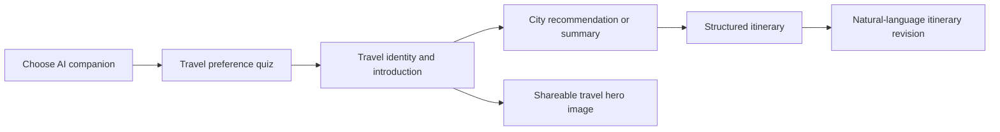
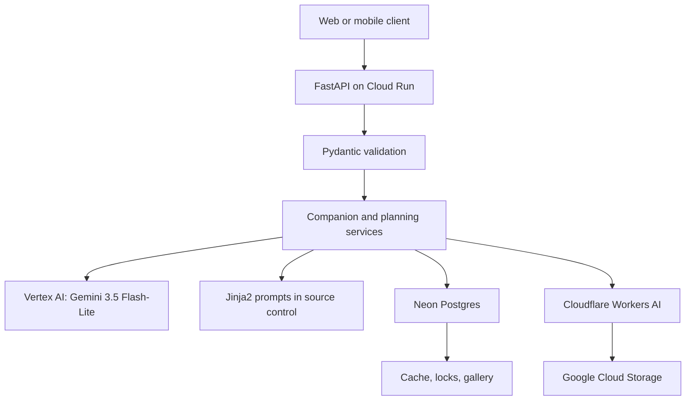
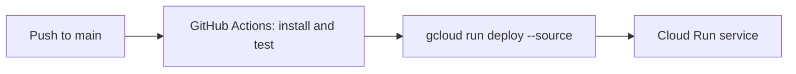
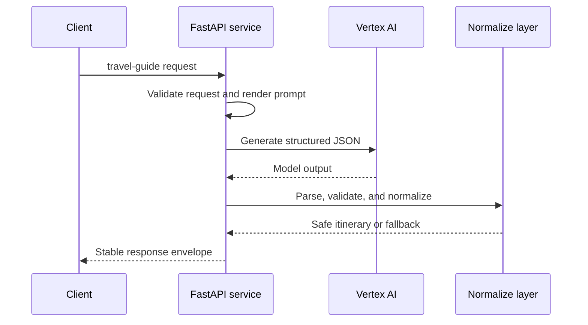

# AI Companion API

> A production-oriented AI travel companion backend built with FastAPI, Vertex AI, and Google Cloud Run.

AI Companion API turns travel preferences and conversational context into structured, editable itineraries. It is designed around a practical constraint of LLM applications: model output is useful but never fully trusted. The service validates, normalizes, and safely degrades every AI-assisted response before returning it to a client.

- Live API: https://ai-companion-api-30568057620.asia-east1.run.app
- Interactive API documentation: https://ai-companion-api-30568057620.asia-east1.run.app/docs
- Health check: https://ai-companion-api-30568057620.asia-east1.run.app/health

## Highlights

| Area | Implementation |
|---|---|
| API | Python 3.11+, FastAPI, Pydantic v2 request contracts |
| Text generation | Vertex AI with `gemini-3.5-flash-lite` and task-level model routing |
| Image generation | Cloudflare Workers AI for travel hero assets |
| Storage | Neon Postgres for cache, locking, and gallery data; GCS for media objects |
| Deployment | GitHub Actions CI/CD to Google Cloud Run |
| Testing | Unit tests, API integration tests, and opt-in live prompt regression tests |

## Product Flow



The API currently exposes 10 public product endpoints, organized into companion setup and trip planning workflows.

| Area | Endpoint | Responsibility |
|---|---|---|
| Companion | `GET /v1/companion/ai-partner` | Provides available companion personas |
| Companion | `POST /v1/companion/quiz` | Selects and adapts quiz questions |
| Companion | `POST /v1/companion/quiz-completions` | Produces travel identity and companion-facing copy |
| Companion | `POST /v1/companion/self-introduction` | Generates a persona introduction |
| Companion | `POST /v1/companion/share-image-v2` | Produces shareable hero-image assets |
| Companion | `GET /v1/companion/quiz-gallery` | Returns generated quiz-result gallery records |
| Planning | `POST /v1/plan/travel-summary` | Initializes the planning context |
| Planning | `POST /v1/plan/recommend-city` | Runs a bounded city-recommendation dialogue |
| Planning | `POST /v1/plan/travel-guide` | Generates a complete structured itinerary |
| Planning | `POST /v1/plan/travel-revise` | Revises an existing itinerary from natural language |

## Architecture



Cloud Run uses its runtime service account and Application Default Credentials to call Vertex AI, so text-generation credentials are not embedded in application code. The service is deployed in `asia-east1` with a 300-second request timeout for long structured itinerary generation.



## LLM Integration and Reliability

The application separates provider transport, task routing, prompts, output parsing, and domain normalization. This makes model-facing code replaceable while keeping API contracts stable.



### Design Decisions

| Problem | Backend decision | Result |
|---|---|---|
| LLM calls can timeout, rate-limit, or return malformed JSON | Convert AI failures to a renderable HTTP 200 response with `fail_reason` and a deterministic fallback | Clients do not receive an unusable partial itinerary or a server error for an expected provider failure |
| Models can invent identifiers or invalid enum values | Normalize outputs through defensive Pydantic and pure-function transformations | Only request-authorized IDs survive; invalid values become safe defaults |
| A model may alter a selected destination | Treat request `city` as authoritative; normalize both values only for equivalence checking, then return the exact request string | `台北` and `臺北` do not false-fail, while a real destination mismatch is rejected |
| Prompts require review and iteration | Store Jinja2 prompt templates in `app/prompts/` | Prompt changes are versioned, diffable, and independent from Python control flow |
| Hero-image generation can fail or hit quota | Cache generated assets and return `hero_image_url: null` on image failure | The itinerary remains usable without blocking on optional media |

### Stable Response Contract

All LLM-backed endpoints use the same reliability contract:

| Situation | HTTP status | Response behavior |
|---|---:|---|
| Invalid request | 400 | Validation envelope with field errors |
| Rate limit reached | 429 | Throttle response |
| LLM transport, parsing, or schema failure | 200 | Renderable fallback plus `fail_reason` |
| Optional image failure | 200 | Main content succeeds; image URL is `null` |

This deliberately distinguishes a malformed client request from an external AI-provider failure. It lets the client render a consistent UI and offer an explicit retry instead of treating every model failure as an application outage.

## Project Structure

```text
app/
	api/          FastAPI routes and dependency injection
	core/         JSON parsing, normalization, throttling, prompt utilities
	prompts/      Version-controlled Jinja2 prompt templates
	schemas/      Pydantic request and response contracts
	services/     Companion, itinerary, LLM, and image workflows
	storage/      Postgres, GCS, cache, and gallery adapters
tests/
	unit/         Pure logic and service tests
	integration/  FastAPI endpoint contract tests
	prompt_regression/  Opt-in live model checks
```

## Development

### Prerequisites

- Python 3.11 or later
- A Google Cloud project with Vertex AI access for real text generation
- Application Default Credentials locally: `gcloud auth application-default login`
- Optional: Neon Postgres, Google Cloud Storage, and Cloudflare Workers AI credentials

### Run Locally

```bash
python3 -m venv .venv
.venv/bin/pip install -e ".[dev]"
.venv/bin/uvicorn app.main:app --reload
```

The API is then available at `http://127.0.0.1:8000`, with interactive documentation at `/docs`.

### Configuration

| Environment variable | Purpose |
|---|---|
| `VERTEX_PROJECT_ID` | Google Cloud project for Vertex AI calls |
| `VERTEX_LOCATION` | Vertex AI location; defaults to `global` |
| `DATABASE_URL` | Neon Postgres connection string; falls back to in-memory storage locally |
| `CLOUDFLARE_ACCOUNT_ID` | Cloudflare Workers AI account |
| `CLOUDFLARE_API_TOKEN` | Cloudflare Workers AI token |
| `LLM_TRAVEL_GUIDE` and other `LLM_*` routes | Per-task provider and model override |

Never commit credentials. Production configuration is supplied through GitHub repository secrets during deployment.

## Testing

```bash
# Unit and integration tests with mocked providers
.venv/bin/pytest

# Live prompt regression tests; uses real model quota
.venv/bin/pytest -m prompt_regression
```

The CI workflow runs all tests except live prompt regression checks on pull requests and pushes. Live checks are intentionally opt-in because LLM output is nondeterministic and consumes provider quota.

## Deployment and Observability

Every push to `main` runs tests in GitHub Actions and, after they pass, deploys the service to Cloud Run.

| Concern | Implementation |
|---|---|
| Authentication | GitHub Actions authenticates to GCP with a repository secret; Cloud Run uses its service account for Vertex AI |
| Runtime | Cloud Run, 512 MiB memory, one CPU, 300-second timeout, scale-to-zero enabled |
| Request visibility | Access logs capture HTTP method, path, status, and duration |
| AI failures | Service logs record provider and image-generation failures; API responses expose `fail_reason` safely |
| Capacity protection | Endpoint-specific in-memory throttling and image cache/lock behavior |

## Known Trade-offs and Next Steps

- The current rate limiter is process-local because the Cloud Run service is intentionally capped at one instance. A distributed limiter is the next step before horizontal scaling.
- Generated imagery is optional and quota-sensitive; text itinerary delivery takes priority when image generation is unavailable.
- Production hardening candidates include distributed rate limits, OpenTelemetry tracing, provider health checks, background image jobs, and a curated prompt-evaluation dataset.

## API Exploration

Start with the interactive documentation, then inspect these representative flows:

1. `POST /v1/companion/quiz-completions` for structured travel identity generation.
2. `POST /v1/plan/travel-guide` for a complete itinerary and safe LLM-output normalization.
3. `POST /v1/plan/travel-revise` for full-itinerary revision from natural-language input.

The `travel-guide` service, its normalization layer, and the accompanying unit/integration tests are the best entry points for reviewing the project's approach to production LLM reliability.
