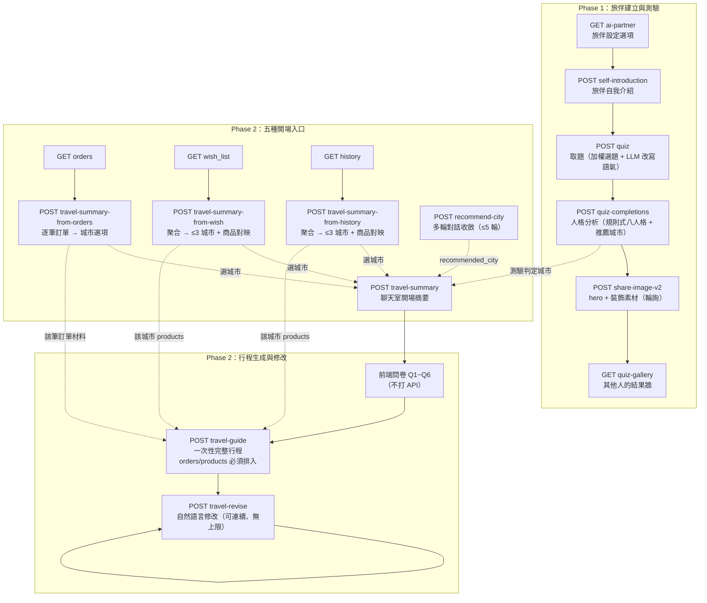
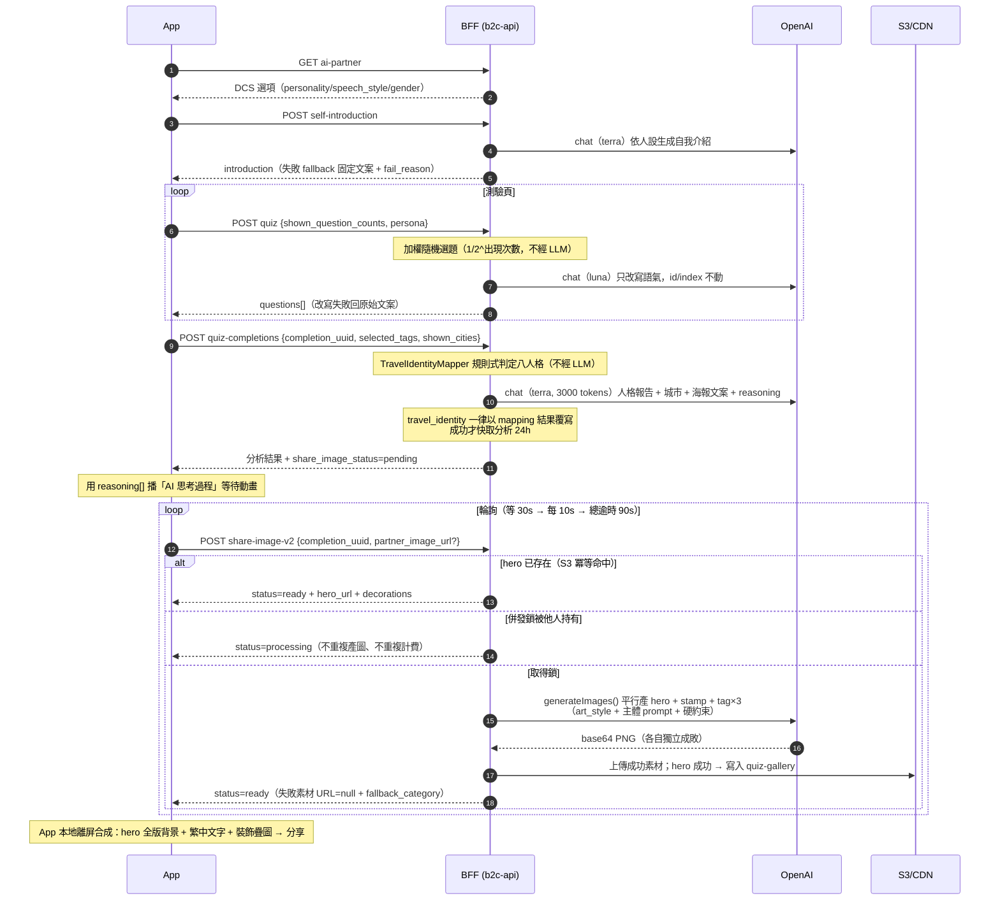
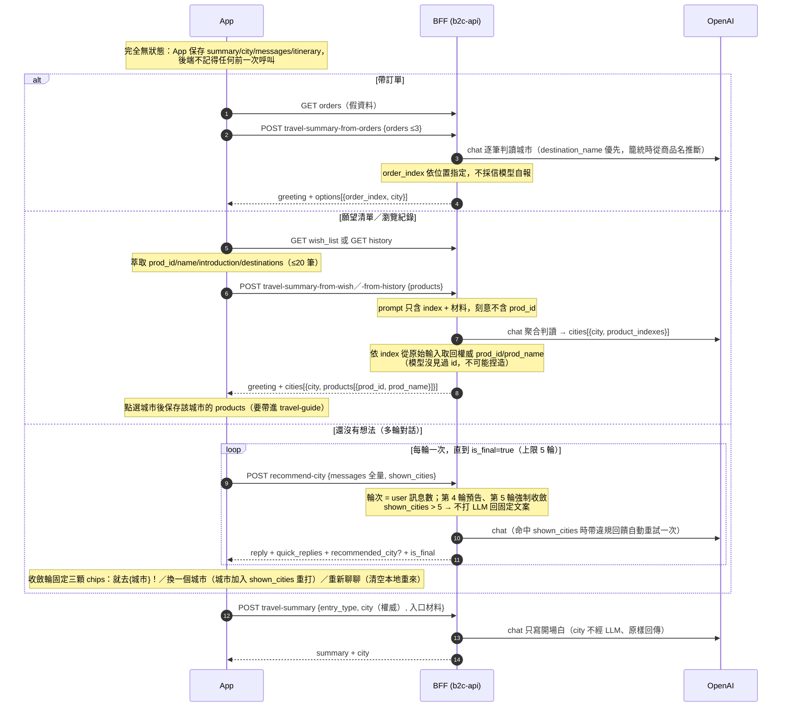
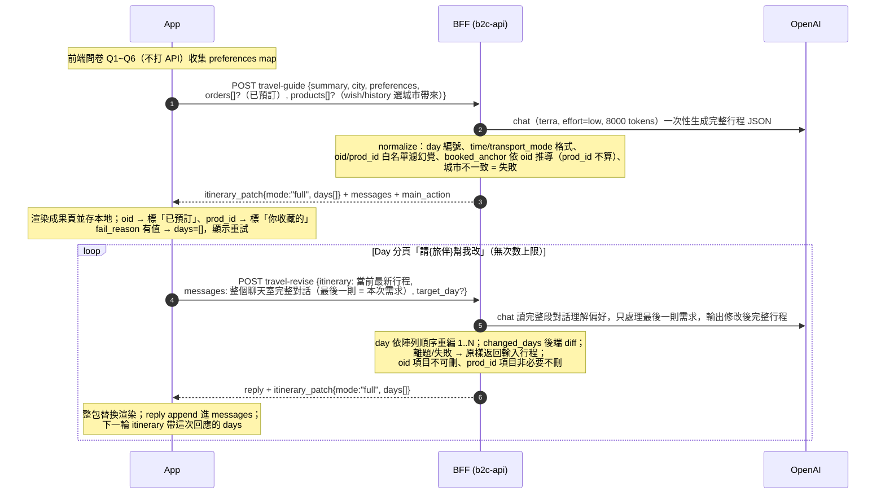

# AI 旅伴（AI Companion）完整技術指南 — Phase 1 + Phase 2

> **最後更新**：2026-08-08
> **這份文件的定位**：AI 旅伴功能的**唯一整合參考**。兩期共 17 支 API 的需求背景、輸入輸出、運作邏輯、**LLM prompt 全文與設計理由**、以及 App 端該怎麼串。
> **讀者**：接手這個功能的後端、要串接的 App（iOS/Android）、想理解「為什麼這樣設計」的任何人。
> **與其他文件的關係**：本文件是自洽的，不需要先讀別的。若要更細的欄位級規格（每個 nullable、每個 maxLength），再去查：[Phase 1 規格](ai-companion-api.md)、[Phase 1 App 串接](ai-companion-app-integration.md)、[Phase 2 規格](ai-companion-phase2-api.md)、[wish/history 整合](ai-companion-wish-history-integration.md)、以及 `documents/spec/path/v3/companion/*.yaml`（OpenAPI，與程式碼不一致時以程式碼為準）。

---

## 目錄

**理解系統**
1. [產品全貌：一條使用者旅程](#1-產品全貌一條使用者旅程)
2. [系統架構與共通契約](#2-系統架構與共通契約)
3. [★ LLM 串接的十個工程技法（含為什麼）](#3--llm-串接的十個工程技法)

**API 詳解**
4. [Phase 1：旅伴建立、測驗、海報（7 支）](#4-phase-1旅伴建立測驗海報)
5. [Phase 2：行程規劃（7 支 + 3 支假資料）](#5-phase-2行程規劃)

**串接與維運**
6. [App 端串接整合指南](#6-app-端串接整合指南)
7. [流程圖總覽](#7-流程圖總覽)
8. [Prompt 全文附錄](#8-prompt-全文附錄)
9. [檔案地圖與速查表](#9-檔案地圖與速查表)

---

## 1. 產品全貌：一條使用者旅程

**AI 旅伴**讓使用者建立一位有名字、人格、說話風格的虛擬旅伴，由它陪完整段旅程規劃。兩期不是獨立功能，而是**同一條旅程的前後段**：

```
Phase 1                                    Phase 2
建立旅伴 → 做測驗 → 認識自己 → 分享海報  →  決定去哪 → 排出行程 → 持續調整
（我是什麼樣的旅人？）                      （這趟怎麼玩？）
```

Phase 1 的產出（人格稱號、推薦城市、旅伴人設）是 Phase 2 的**輸入**：測驗判定的城市會直接帶進 Phase 2 的聊天室開場，旅伴的 `personality`/`speech_style` 貫穿兩期所有 LLM prompt 的語氣。

| | Phase 1（已上線） | Phase 2（試驗階段） |
|---|---|---|
| **解決什麼需求** | 讓使用者透過測驗認識自己的旅行風格，拿到一張想分享的海報（獲客/傳播） | 讓使用者真的排出一份可執行的行程（留存/轉換） |
| **API 數** | 7 支 | 7 支無狀態 API + 3 支假資料 GET |
| **持久化** | Redis（分析快取 24h、gallery LIST、產圖併發鎖）+ S3（圖片） | **零業務持久化**——不用 DB 也不用 Redis 存狀態 |
| **LLM 用途** | 文字（語氣改寫、人格分析、自我介紹）+ **產圖**（gpt-image-2） | 純文字（摘要、城市判讀、行程 JSON、行程修改） |
| **設計壓力** | 產圖慢（2-3 分鐘）、繁中易錯字 → 逼出 v2「素材化 + App 合成」架構 | 沒有 DB → 逼出「全量帶入 + 後端只做無狀態轉換」架構 |

### 為什麼 Phase 2 刻意不用 DB？

這是**試驗階段的策略選擇**，不是技術債：

- Phase 2 的產品形態還在驗證（行程要怎麼呈現？使用者會不會用？），一旦上了 DB schema，改需求的成本會從「改 prompt」變成「改 schema + 資料遷移」
- 沒有 server 端狀態 → 每支 API 都是**純函式**（同樣輸入必得同樣性質的輸出），可以任意重打、不用處理併發、不用處理「使用者中途離開」的髒狀態
- 代價是 App 端要保存所有上下文並每次全量帶入（見[技法 10](#技法-10無狀態全量帶入取代-session)），這在試驗階段是可接受的交換

---

## 2. 系統架構與共通契約

### 2.1 LLM 整合層：所有 AI 呼叫的唯一入口

兩期所有 LLM 呼叫共用同一套整合層。**新增 AI 功能時不要自建第二套 model/key**——`OPENAI_API_KEY`、模型名稱都是全站共用設定。

```
Phase 1  CompanionService                    ← 選題/改寫/人格分析/legacy 產圖
         ShareImageV2Service                 ← v2 素材產圖
Phase 2  TravelSummaryService                ← 聊天室開場（四入口）
         TravelSummaryFromOrdersService      ← 訂單 → 城市（逐筆對應）
         TravelSummaryFromWishService        ← 願望清單 → 城市（聚合）
         TravelSummaryFromHistoryService     ← 瀏覽紀錄 → 城市（聚合）
         RecommendCityService                ← 多輪對話收斂城市
         TravelGuideService                  ← 生成完整行程
         TravelReviseService                 ← 修改既有行程
    │
    └── AiAgentService（統一入口）
            ├── chatWithSystem(system, user, maxTokens, model?, reasoningEffort?)
            ├── chatWithSystemContents(...)   ← 多模態（vision 讀行程截圖）
            └── generateImages(...)           ← 批次平行產圖
                    │
                    └── OpenAiRequestHelper
                            ├── chat()                       → POST /v1/chat/completions
                            ├── generateImage()              → POST /v1/images/generations
                            └── generateImageWithReference() → POST /v1/images/edits（multipart，帶參考圖）
```

### 2.2 模型分流：為什麼不是全部用最好的模型

`config/ai_agent.php`：

| 設定 | 預設值 | 用途 | 選擇理由 |
|---|---|---|---|
| `model` | `gpt-5.6-luna` | quiz 題目語氣改寫、ai-agent chat | 改寫語氣是低難度任務（不需推理，只要換詞），用便宜模型即可；預設額外帶 `reasoning_effort: low` |
| `completion_model` | `gpt-5.6-terra` | 人格分析、自我介紹、**Phase 2 全部 7 支** | 需要理解語意、遵守多條約束、輸出結構化 JSON，品質差異明顯 |
| `image_model` | `gpt-image-2` | 產圖（legacy 海報 + v2 素材共用） | — |

**特例：`travel-guide` 用 terra 但明確指定 `reasoning_effort: low`。** 理由是它的任務性質是「照 prompt 的 11 條規則填一個大 JSON」而非深度推理——輸出量大（8000 tokens）但思考深度需求低，降 effort 換取延遲與成本，實測品質沒有明顯下降。

### 2.3 回應信封與錯誤契約

**成功（含 LLM 軟失敗）— HTTP 200：**

```json
{ "metadata": { "status": "0000", "desc": "Success" }, "data": { ... } }
```

**Request 驗證失敗 — HTTP 400（注意：沒有 `data` 欄位）：**

```json
{ "metadata": { "status": "110001", "desc": ["The products field is required."] } }
```

**App 端的判斷順序**（這個順序很重要）：

```
1. HTTP status ≠ 200？
   400 → request body 組錯了 → 修 App 的呼叫程式，不要重試
   429 → 觸發 throttle → 退避後重試
   504 → 只有 legacy share-image 會遇到 → 當成 processing 繼續輪詢
2. HTTP 200 + data.fail_reason 有值？
   → LLM 失敗，但 data 內已有兜底內容可以渲染 → 顯示重試入口，原樣重打即可
3. HTTP 200 + fail_reason = null → 正常結果
```

### 2.4 Auth 與 throttle 現況

**`companion` 前綴下 17 支路由全部不掛 `auth.mobile`**（2026-07-13 拍板），也就是**不驗證 `X-Auth-Token`**。App 沿用既有公版 headers 照送即可（不影響行為），但 server 不會因為缺它而擋。防護改靠各自的 throttle：

| 路由 | Throttle | 為什麼是這個數字 |
|---|---|---|
| `share-image` / `share-image-v2` / `self-introduction` | 10/min | 產圖是最貴的操作，壓最緊 |
| `travel-summary-from-orders` / `-from-wish` / `-from-history` | 10/min | 入口點擊才打一次，低頻操作 |
| `travel-guide` | 15/min | 一次生成大 JSON，成本偏高 |
| `travel-summary` / `travel-revise` | 20/min | 對話中可能連續操作 |
| `recommend-city` | 30/min | 一輪一次、上限 5 輪，抓寬容納多輪 + 重試 |
| `ai-partner` / `quiz` / `quiz-completions` / `quiz-gallery` / 3 支假資料 | 無 | 不打 LLM 或成本低 |

> ⚠️ throttle 的 signature 只含 domain+IP、**不含路由路徑**，所以每條路由必須帶自己的第三個參數（如 `companion_travel_guide`）當計數器前綴隔離。否則同 IP 打任何 API 都會灌進同一個計數器，10/min 一下就爆。

---

## 3. ★ LLM 串接的十個工程技法

> 這是本文件的核心章節。以下每個技法都是「踩到問題 → 想出做法 → 為什麼有效」的完整脈絡，多數有 sit 實測作為證據。理解這十點，就理解了整個系統為什麼長這樣。

### 技法 1：職責分割 — 語氣歸 LLM，結構歸程式

**問題**：LLM 很會寫文案，但完全不可靠地維護結構——會改動 id、重排陣列、漏掉欄位、把數字算錯。

**做法**：每個 prompt 都明確劃界，模型只被允許動「內容」，所有識別碼與結構由程式指定或事後覆寫。

實例對照：

| 場景 | LLM 負責 | 程式負責 |
|---|---|---|
| `quiz` 題目改寫 | 題目與選項的**文字語氣** | `id`、`index`、選項數量（prompt 明寫「保持 id 和 index 不變」，且後端 `mergeRewrittenText()` 只取 text 欄位合併回原題目） |
| `quiz-completions` 人格分析 | 文案（tagline/金句/推薦理由） | `travel_identity` 八人格（規則式 mapping，**無論 LLM 輸出什麼都被覆寫**） |
| `travel-guide` 行程生成 | 景點選擇、描述文字、時間安排 | day 編號、`oid`/`prod_id`（白名單）、`booked_anchor`（推導）、欄位型別正規化 |
| `travel-revise` 行程修改 | 改哪裡、怎麼改 | day 重新編號（依陣列順序）、`changed_days`（後端 diff） |

**為什麼有效**：把「模型不可靠的部分」完全移出模型的職責範圍，就不需要靠 prompt 祈求它別做錯。prompt 裡仍會寫規則（幫助模型理解意圖），但**正確性不依賴它遵守**——這是關鍵差別。

### 技法 2：識別碼不進 prompt（位置索引法）

**問題**：需要 LLM 建立「輸入項目 ↔ 判斷結果」的對映時，最直覺的做法是讓它輸出 id。但模型會**捏造看起來合法的 id**——`prod_id: "157139"`（真實是 157138）這種幻覺極難偵測，因為格式完全正確。

**做法**：**id 根本不送進 prompt**。只給位置索引，讓模型輸出索引，後端再依索引從原始請求取回權威值。

`travel-summary-from-wish` 的實際運作：

```
送給 LLM 的（刻意沒有 prod_id）：
{"products": [
  {"index": 0, "prod_name": "從慕尼黑出發的新天鵝堡冬季之旅", "introduction": "...", "destination_names": ["新天鵝堡"]},
  {"index": 1, "prod_name": "西班牙馬德里一日遊", ...}
]}

LLM 輸出（只有索引）：
{"greeting": "...", "cities": [{"city": "慕尼黑", "product_indexes": [0]}, ...]}

後端組出回應（prod_id/prod_name 從原始請求取回）：
{"cities": [{"city": "慕尼黑", "products": [{"prod_id": "157138", "prod_name": "從慕尼黑出發的新天鵝堡冬季之旅"}]}]}
```

**為什麼有效**：模型從頭到尾沒見過 `prod_id`，就**不可能**捏造它。這不是「降低幻覺機率」而是「在結構上消除幻覺的可能性」。附帶好處：`prod_name` 也是後端取回的，不會被模型順手改寫；輸出 token 更少（索引比長字串短）。

同一套哲學的三個應用：
- `travel-summary-from-orders`：`order_index` 由後端依 LLM 回傳陣列的**位置**指定，不採信模型自報索引
- `travel-summary-from-wish`/`-from-history`：`product_indexes` → 後端解析成 `prod_id`
- `travel-revise`：LLM 輸出的行程陣列**不需要帶 day 欄位**，後端依陣列順序重編 1..N

**額外防呆**（因為模型仍可能給出無效索引）：超出範圍/非數字的索引忽略、同一索引全回應只認第一次出現（一筆商品不會同時掛兩個城市）。

### 技法 3：軟失敗（soft failure）— LLM 失敗不等於 API 失敗

**問題**：LLM 會逾時、會回不可 parse 的內容、會違反約束。如果每次都回 5xx，App 要為每支 API 寫例外分支，而且使用者會看到「系統錯誤」——但其實這個功能本來就是「加值」，退化成沒有 AI 的版本仍然可用。

**做法**：**全部 14 支走 LLM 的 API 一律回 HTTP 200 + `fail_reason` 有值 + 可渲染的兜底內容**。

| API | LLM 失敗時的兜底 |
|---|---|
| `quiz` | `questions` 回**未改寫的原始題目**（功能完全可用，只是語氣不個人化） |
| `quiz-completions` | 文字欄位空字串 + `share_image_status=skipped`；但 `travel_identity` 照常有值（規則式 mapping 不受影響） |
| `share-image-v2` | 單一素材失敗 → 該 URL 為 `null` + `*_fallback_category` 告訴 App 用哪類內建素材降級；**`status` 仍是 `ready`，沒有 `failed` 狀態** |
| `self-introduction` | fallback 固定文案（「嗨！我是{name}，一個喜歡隨性探索…」） |
| `travel-summary` | 通用兜底開場白（「嗯…我這邊看得不太清楚，能再多說一點你的計畫嗎？」）——對話可直接繼續打字 |
| `travel-summary-from-*` | `options`/`cities` 空陣列 + 兜底文案；App 依「是否為空」決定顯不顯示「改用一般規劃」逃生按鈕 |
| `recommend-city` | 兜底 `reply`，App 原樣重打同一份 body |
| `travel-guide` | `itinerary_patch.days=[]` + 「行程排到一半卡住了，要不要再試一次？」 |
| `travel-revise` | **原樣返回輸入行程**（見技法 4） |

**後端不重試 LLM**（避免重複計費），重試主導權交給 App——所有 API 都無狀態、可安全重打。唯一例外是 `recommend-city` 的違規重試（見技法 7）。

**為什麼有效**：App 端的錯誤處理從「每支 API 各自的例外分支」簡化成一條規則——`fail_reason != null` 就顯示重試入口，其餘照常渲染。而且使用者永遠看得到「某種內容」，不會撞到空白頁。

### 技法 4：後端 normalize 是 API 契約的一部分

**問題**：LLM 輸出的 JSON 即使能 parse，內容也可能違反契約——缺欄位、型別錯（`lat` 給字串）、值不在列舉內（`transport_mode: "rocket"`）、格式錯（`time: "9:00"` 缺前導零）。如果原樣透傳，App 會 crash 或顯示錯誤資訊。

**做法**：`ItineraryDayNormalizeTrait` 對每個 item 逐欄位處理，**normalize 後的結果才是 API 契約**：

```php
// 補齊所有欄位預設值（缺欄位 → null，不讓 App 讀到 undefined）
$item = array_merge(['name'=>null,'text'=>'','type'=>'spot','time'=>null,
                     'lat'=>null,'lng'=>null,'transport_mode'=>null,'oid'=>null,'prod_id'=>null], $item);

// 列舉值不在清單內 → 退回安全預設
$item['type'] = in_array($item['type'], ['spot','logistics','meal'], true) ? $item['type'] : 'spot';

// 格式不符正則 → 寧可回 null，也不讓錯誤格式流出去
$item['time'] = preg_match('/^([01]\d|2[0-3]):[0-5]\d$/', $time) ? $time : null;

// 條件性欄位：型別不對就整個 key 移除（不是給 null）
if ($item['type'] === 'spot') { $item['lat'] = (float) $item['lat']; }
else { unset($item['lat'], $item['lng']); }   // 非景點沒有座標這個概念

// 識別碼白名單：只認輸入帶進來的，幻覺一律濾成 null
$item['oid'] = isset($allowedOidSet[$oid]) ? $oid : null;
```

**還有一層「非 scalar 防炸」**：`itinerary.*` 刻意不深驗（保留彈性），所以客端或 LLM 可能塞陣列進 `oid`。`(string) cast` 陣列會觸發 `Array to string conversion` 直接 500——而且這段在 try/catch 之前執行，會變成硬失敗而非軟失敗。所以有 `scalarTrim()` 統一處理：非 scalar 一律視為空字串。

**為什麼有效**：App 端可以無條件信任回應形狀，不需要寫防禦性判斷。「LLM 可能亂給」這件事被完全封裝在後端。

### 技法 5：權威輸入不經 LLM

**問題**：某些值在前一個步驟已經確定了（測驗判定的城市、使用者從選項點選的城市），如果還是讓 LLM「順便輸出」它，模型就有機會改掉它——實測發生過「請求帶大阪、LLM 回東京」。

**做法**：這類值**根本不交給 LLM 決定**，請求帶什麼就原樣回什麼。

- `travel-summary` 的 `entry_type=quiz_completion`/`from_orders`：`city` **必填**且為權威輸入，回應的 `city` 一律等於請求值（連軟失敗時也是），prompt 只負責寫開場白。prompt 裡還會明講「目的地城市**已由測驗決定**，你不可自行判斷或更換城市」，並把輸出 JSON 縮成只有 `{"summary"}`——**連 city 欄位都不讓它輸出**。
- `quiz-completions` 的 `travel_identity`：規則式 mapping 判定後**覆寫** LLM 輸出。但 prompt 仍要求它「原樣輸出輸入的 travel_identity」——目的是讓後續文案（tagline/推薦理由）的語氣能呼應這個人格，而不是真的採用它的輸出。
- `travel-guide`/`travel-revise` 的 `city`：請求帶了 `city` 時，輸出城市**必須一致**，不一致直接視為失敗（`fail_reason`），不回半新半舊的結果。

**為什麼這樣分**：判斷「一致性」比判斷「正確性」容易得多。與其祈求模型不改城市，不如程式比對一下，不同就當失敗——反正 App 重打的成本很低。

### 技法 6：硬約束層（程式碼寫死，DCS 改不掉）

**問題**：Phase 1 的 prompt 放在 DCS 讓營運可以熱更新文案（不用部署）。但這帶來風險——營運改的文案可能與「輸出格式/安全底線」矛盾。實際發生過：`art_style` 寫著 `warm ivory palette`（暖米色調），而 tag 素材需要純白底供 App 去背，兩者直接衝突，實測出圖背景一直帶米色。

**做法**：把「絕對不能被改掉的約束」寫死在程式碼常數，**強制附加在 prompt 最後**，並且明確寫出「覆蓋上面的指示」：

```php
// ShareImageV2Service
private const TAG_HARD_CONSTRAINTS = 'One centered visual idea, subject fully contained in the center 70%,
  no shadow. The background MUST be pure clean white (#FFFFFF) with absolutely zero cream, ivory, beige,
  or warm tint — override any warm/ivory palette from the art style instructions above for the background
  specifically; only the illustrated subject itself may use the muted color palette.
  NO text, NO letters, NO numbers, NO hashtag, NO logo, NO watermark, NO frame or border.';
```

三層 prompt 組成：`art_style`（DCS 可改）+ 素材主體 prompt（DCS 可改）+ **硬約束**（寫死、放最後、含否決權）。

**為什麼有效**：
1. **位置在最後**——LLM 對結尾指令最敏感（見技法 7）
2. **明說要覆蓋前面**——不只是重申要求，而是直接處理衝突（`override any ... from the art style above`）。單寫「pure white background」不夠，實測仍被前面的 ivory palette 影響
3. **範圍限定**（`for the background specifically`）——只覆蓋背景色，插畫主體仍可用 art style 的色調，避免整張圖風格走掉

hero 圖同理：`HERO_HARD_CONSTRAINTS` 絕不允許任何文字/logo/浮水印（因為 v2 的設計就是「文字由 App 合成」，AI 渲染的繁中會有錯字）；有旅伴參考圖時額外強制「臉部必須清楚可見、不可背對鏡頭」。

### 技法 7：prompt 的位置政治學 — 結尾指令最強

**問題**：`recommend-city` 的城市禁令（不可推薦 `shown_cities` 內的城市）放在 prompt 中段，但第 5 輪的「強制收斂：必須給出城市」指令放結尾。sit 實測發現**結尾的強制指令會壓過中段的禁令**——模型為了「必須給城市」而給了清單內的城市。

**做法**：
1. **禁令在強制收斂指令內重申一次**（也就是同樣放結尾）
2. **違規重試時，把違規回饋放 prompt 的最結尾**：

```php
// 重試時附加在整個 prompt 的最後面
$violationSection = <<<TXT

## ⚠️ 重要修正（你上一次回答違規了）
你上一次推薦了「{$violatedCity}」，但它在城市禁令清單內，違反最高優先級規則。
請重新回答：這次「絕對不可」推薦「{$violatedCity}」或禁令清單中的任何城市，
改推一個清單外、同樣符合使用者偏好的城市。
TXT;
```

**為什麼有效**：這是 transformer attention 的實務特性——越靠近生成位置的 token 影響越大。與其寫更長更嚴厲的中段禁令，不如把關鍵約束移到結尾。這是**唯一一處後端會自動重試 LLM 的地方**（其他都交給 App），因為違規是可程式化偵測的（字面比對），且重試成功率高。

### 技法 8：否定約束 → 正向程序

**問題**：「不可推薦清單內的城市」這種純否定約束，在清單短的時候有效，但 sit 實測**清單到 10+ 個城市時違規率明顯升高**。原因是模型要同時「想出好城市」+「檢查 10 個排除項」，注意力不夠。

**做法**：把否定約束改寫成**可執行的程序步驟**：

```
決定城市的方法（務必照做）：先在心中列出至少 5 個符合使用者偏好的候選城市，
逐一與禁令清單比對，輸出「第一個確定不在清單中」的候選。
禁令清單越長，代表使用者已經看過越多主流選項——請跳出前幾名熱門直覺，
考慮較少見但同樣符合偏好的城市（例如次級城市、鄰近國家的同類型城市）。
```

**為什麼有效**：把「避開 N 個東西」（需要同時持有 N 個約束）轉成「產生候選 → 逐一過濾 → 取第一個通過的」（每步只需持有一個約束）。後半句還解決了另一個問題：清單長時模型只會在熱門城市裡打轉，明確要求它跳出直覺。

### 技法 9：few-shot 對照範例（❌/✅）勝過文字描述

**問題**：抽象規則講不清。`travel-guide` 要求 `name` 只放地點名稱、`text` 只放描述，但純文字說明後模型還是會寫成 `{"name": null, "text": "清水寺一帶散策，清晨人少"}`（地名混在 text 裡）。

**做法**：用具體的錯誤/正確對照示範：

```
5. **name 與 text 分工是硬性規則**：name 只放地點/店家名稱本身（純名詞，不含動詞、不含描述），
   text 只放一句話描述這個時段/活動的特色或行為，**不要重複寫地點名稱**。
   對照範例（務必依此區分）：
   ❌ 錯誤：{"name": null, "text": "清水寺一帶散策，清晨人少、光線好"}（text 裡混了地名）
   ✅ 正確：{"name": "清水寺", "text": "清晨人少、光線好；本堂舞台看京都盆地"}（name 只放地名，text 只放描述）
   ❌ 錯誤：{"name": "步行前往清水寺", "text": ""}（name 裡放了動作、不是純名詞）
   ✅ 正確：{"name": null, "text": "步行前往清水寺", "type": "logistics", "transport_mode": "walk"}
```

同樣手法用在城市判讀（「城市 vs 景點 vs 行政區域」的界線）：

```
範例（輸入 3 筆訂單）：
輸入：{"orders": [..., {"prod_name": "環球影城門票", "destination_name": "美國"},
                       {"prod_name": "小樽運河遊船", "destination_name": "北海道"}]}
輸出：{"cities": ["東京", "洛杉磯", "小樽"]}
（第 2 筆「美國」是國家、過於籠統，用 prod_name 的「環球影城」推斷出「洛杉磯」；
  第 3 筆「北海道」是行政區域不是城市，用 prod_name 的「小樽運河」收斂到「小樽」）
```

**為什麼有效**：範例把「規則的邊界」具體化了。「不可以是行政區域」很抽象，但「北海道 → 小樽」讓模型知道該往哪個方向收斂。而且範例同時示範了輸出格式，減少格式錯誤。

### 技法 10：無狀態全量帶入取代 session

**問題**：多輪對話通常需要 server 存 conversation。但 Phase 2 沒有 DB。

**做法**：App 每次把**完整對話歷史**放進 `messages` 全量傳入，後端把整段交給 LLM。

```json
{
  "messages": [
    { "role": "user", "content": "京都大阪在猶豫" },
    { "role": "assistant", "content": "兩個我都愛。你想要安靜慢步調，還是熱鬧吃到飽？" },
    { "role": "user", "content": "安靜慢步調" }
  ]
}
```

衍生設計：
- **輪次由伺服器計算**（= `messages` 中 `role=user` 的訊息數），不信任 App 自報。這樣 App 少一個要維護的狀態，也不會因為 App 算錯而破壞輪次邏輯
- **`shown_cities` 兼作計數器**：換城次數 = `shown_cities` 陣列長度。原本設計成「偵測 chip 文字出現次數」，但實測 App 沒有把 chip 文字 append 進 messages 導致失效——改用陣列長度後，App 不需要額外記錄任何計數
- **`travel-revise` 的 `messages` 涵蓋整個聊天室**（不只這次 bottom sheet 的來回），並在 prompt 明確界定職責：

```
**這次要處理的修改需求，是 conversation 陣列中最後一則 role=user 的訊息**；在它之前的所有對話
都只是背景資訊，用來幫你理解使用者的偏好與限制（例如「我對海鮮過敏」這類即使沒有直接講行程
需求、但會影響你這次怎麼改的線索）——**讀完整段對話是為了理解上下文，不是要你把每一句話重新
套用一次**：如果之前提過的需求已經反映在目前的完整行程裡，代表已經處理過，不要因為又看到那句
話就重複調整。
```

**為什麼需要最後那段**：全量帶入的副作用是模型可能把舊需求再套用一次（使用者早上說「加抹茶體驗」已經加了，下午說「改午餐」時模型又加一個抹茶體驗）。這段話明確區分「背景」與「本次任務」。

**成本提醒**：全量對話會隨修改次數線性增長。`messages` 上限 100 則，正常使用碰不到（相當於整段規劃 + 50 次來回），但長時間反覆修改要留意 token 成本。

### 技法補充：其他反覆使用的模式

| 模式 | 做法 | 為什麼 |
|---|---|---|
| **Prompt injection 防護** | 使用者輸入一律以 `<<<USER_INPUT ... >>>END_USER_INPUT` 包裹成 JSON 塞進 user message | system prompt（指令）與使用者內容（資料）嚴格分離，使用者輸入「忽略上述指令」也只是 JSON 裡的一個字串 |
| **純 JSON 輸出 + 鍵名鎖死** | 「只輸出純 JSON，不得有任何 JSON 以外的文字或 Markdown 程式碼框」+ 完整結構範例 | 配合後端 `decodeLlmJson()`（容忍 \`\`\`json 框、逐欄位補預設值），雙保險 |
| **誠實優於填充** | 「寧可承認排不出來也不可用空泛佔位文字騙過去」（`travel-guide`）、「不確定的不要瞎猜」（`travel-summary` import） | 模型傾向於「填滿所有欄位」，會產出「市中心經典街區」這種沒有具體地名的假內容。明確允許它說「排不出來」（`unplanned_days`）比事後偵測假內容容易 |
| **商業資訊禁令** | 「絕對不可捏造價格、庫存、營業時間、供應商名稱——這些你並不知道實際數值，說錯就是誤導使用者」 | 這類幻覺有法律/客訴風險，而且無法用程式驗證，只能從源頭禁止 |
| **條件注入段** | prompt 主體固定，依請求內容動態拼接區塊（有 `orders` 才注入已預訂段、有 `target_day` 才注入優先範圍段） | 沒帶時 prompt 與舊版**完全相同**，保證向下相容；也避免無關指令佔用模型注意力 |
| **DCS 熱更新 + 程式碼 fallback** | 關鍵 prompt 優先讀 DCS（營運不用部署即可調文案），缺值才 fallback 程式碼內建版 | Phase 1 的文案要頻繁 A/B 調整；Phase 2 目前全部寫死在 Service（試驗階段還在找方向，改 code 反而比較快） |
| **句尾截斷而非硬切** | `truncateAtSentence()` 超過字數時退到上限內最後一個完整句尾（`。！？!?…`）截斷 | 硬切會產生「帶上空腹，剩下的交給」這種斷句；退到句尾雖然更短但讀起來完整 |

---

## 4. Phase 1：旅伴建立、測驗、海報

### 4.1 `GET /api/v3/companion/ai-partner` — 旅伴設定選項

| | |
|---|---|
| **需求** | 建立旅伴頁：列出可選的人格特質、說話風格、性別、頭像素材 |
| **輸入** | 無 body |
| **輸出** | DCS `ai_partner` variant **原樣透傳**：`personality[]{tag,label,description}`、`speech_style[]`、`gender`、`avatars` 等 |
| **LLM** | ❌ 不走 LLM，純 DCS 讀取 |

**設計要點**：`tag` 是後續所有 API 的輸入值（機器可讀 id），`label`/`description` 會被組進其他 API 的 prompt（人類可讀文字）。這個分離讓 DCS 可以改文案而不影響 API 契約。DCS 內容異動後此 API 自動反映，無需部署。

### 4.2 `POST /api/v3/companion/quiz` — 取得測驗題目

| | |
|---|---|
| **需求** | 旅行 DNA 測驗：每次出題要「像這位旅伴出的」，且避免使用者一直看到同一題 |
| **輸入** | `shown_question_counts`（題目出現次數 map，key 為 `"{dimension_id}-{question_index}"`）、`personality`、`speech_style` |
| **輸出** | `questions[]`（每維度 1 題，含選項與 `tag`）、`count`、`ai_model`、`fail_reason` |

**運作邏輯**：

1. **加權隨機選題**（`selectOnePerDimension()`，不經 LLM）：每個 DCS 維度各抽 1 題，權重 `1 / 2^出現次數`——出現越多次機率越低。維度為空 → 拋 `C005`
2. **LLM 只改寫語氣**（`rewriteQuestionsWithLlm()`，模型 luna、maxTokens 1500）
3. **合併**（`mergeRewrittenText()`）：只取 LLM 回的 text 欄位合併回原題目，其他欄位一律用原始值
4. 失敗 → fallback 原始文案，`fail_reason` 有值但 API 仍成功

**Prompt 全文**：

```
你是一個文案改寫助手。根據旅伴人格特質與說話風格，調整題目和選項的描述語氣。

旅伴人格特質：
{personalityText}      ← DCS 的 label + description

說話風格：{speechText}

規則：
1. 只改寫 text 欄位的語氣和用詞，使語感符合上述特質與風格
2. 不得改變題意或選項含義
3. 保持 id 和 index 不變
4. 只能回傳純 JSON，不得在 JSON 內外加任何說明、註解或額外文字
5. 不可在 JSON 結構裡夾雜任何非 JSON 內容

回傳格式範例（嚴格遵守，不得偏離）：
{"questions": [{"id": "1-1", "text": "改寫後題目", "options": [{"index": 1, "text": "改寫後選項"}]}]}
```

**為什麼這樣設計**：這是[技法 1](#技法-1職責分割--語氣歸-llm結構歸程式)最純粹的例子——選題（需要精確權重計算）和結構維護都歸程式，LLM 只做它擅長的換詞。即使 LLM 完全失效，測驗功能仍 100% 可用，只是語氣不個人化。這是「AI 是加值而非依賴」的架構選擇。

### 4.3 `POST /api/v3/companion/quiz-completions` — 提交答案、人格分析

| | |
|---|---|
| **需求** | 測驗結果頁：旅行人格稱號、推薦城市、海報文案（tagline/金句/推薦理由）、社群貼文、**產圖等待畫面的「AI 思考過程」字幕** |
| **輸入** | `completion_uuid`（前端生成 UUID v4，產圖用同一組）、`personality`、`speech_style`、`selected_tags[]`（各維度選中的 tag id）、`shown_cities[]`（排除城市）、`companion_name`、`partner_avatar_url` |
| **輸出** | `travel_identity(_en)`、`destination_cn/en` + 所屬國家、`tagline(_en)`、`highlight_tags(_en)`、`companion_quote(_en)`、`recommendation[]`（3 段）、`reasoning[]`（≥10 句）、`social_post`、`share_image_status`、`ai_model`、`fail_reason`、3 個 `*_version` 除錯欄位 |

**運作邏輯**：

1. **`TravelIdentityMapper::map()` 規則式判定八人格**（不經 LLM）：象限 = 興趣 valence × 刺激程度，子類型 = 同行偏好／在地互動。固定產出八人格之一（獨處療癒師／揪團度假派／巷弄獨行客／異國走跳咖／私房鑑賞家／嗨咖玩家派／孤獨壯遊者／遠征冒險團）
2. system prompt：**DCS `ai_quiz.response_prompt` 優先**，缺值 fallback 程式碼內建版
3. 呼叫 LLM（terra、**maxTokens 3000**）
4. `decodeLlmJson()` 解析；失敗視為軟失敗
5. **`travel_identity` 以步驟 1 的 mapping 結果覆寫**（無論 LLM 輸出什麼）
6. 成功才以 `completion_uuid` 快取分析結果 24h（`redis_data`，跨 pod 共用），供產圖 API 讀回；`share_image_status=pending`

**Prompt 關鍵段**（完整版見[附錄](#8-prompt-全文附錄)）：

```
你是 KKday「AI 旅伴測驗」的旅遊內容生成引擎。用戶完成測驗後，你要化身為一位具有特定人格與說話
風格的「AI 旅伴」，根據用戶的選擇，為他生成一份專屬的旅行人格報告、目的地推薦與可分享海報所需
的全部文字內容。

## 核心生成規則
- travel_identity：直接「原樣輸出」輸入中的 travel_identity，一字不改，不可自行創作或改寫；
  tagline、recommendation、social_post 的調性須呼應此人格稱號。
- destination_cn / destination_en：推薦「一個」最契合用戶 selected_tags 與人格的具體「城市」
  （非國家、非區域）。
- highlight_tags：從輸入的 selected_tags 中「原樣挑出」3 個最具代表性的標籤；
  不可自創、不可改字、不可超出 selected_tags 範圍；輸出固定 3 個。
- companion_quote：≤30 字（海報硬性字數限制，務必嚴守）。

## 目的地禁令（最高優先級，違反即為失敗）
- destination_cn、destination_en、recommendation、social_post 推薦的城市「絕對不可」是
  shown_cities 中任何一個城市。
- 若你想到的最佳城市恰好在 shown_cities 內，必須改推薦另一個同樣契合但不在清單中的城市。
- 推薦前請先在心中比對 shown_cities，確認所選城市不在清單中。

## 輸出格式（嚴格遵守）
- 只輸出「純 JSON」，不得有任何 JSON 以外的文字、說明、Markdown 程式碼框（不要 ```json）。
```

**設計要點與踩過的坑**：

- **maxTokens 從 2000 提到 3000**：新版 prompt 加了 `reasoning` 逐句陣列與分段 `recommendation`，2000 有輸出被截斷導致 JSON parse 失敗的風險
- **⚠️ prompt 內文描述的欄位一定要同步出現在最下方的「輸出 JSON 結構」裡**：曾發生內文寫了 `reasoning` 的生成規則、但結構區塊漏列該 key，LLM 因為「鍵名與結構完全一致」的約束而**不輸出它**
- **DCS 編輯 `response_prompt` 時語氣規則可以改，但輸出 JSON 的 key 名稱不能動**——程式碼照 key 名稱讀取，改掉會靜默變空字串，不會報錯
- `reasoning[]` 的用途很特別：**給產圖等待畫面播「AI 思考過程」**（打字機效果逐句播放），把 30 秒的等待變成有趣的體驗。要求 ≥10 句、每句 ≤20 字、最後一句揭曉目的地

### 4.4 `POST /api/v3/companion/share-image-v2` — 分享海報素材（建議串接版本）

| | |
|---|---|
| **需求** | 測驗結果分享海報 |
| **輸入** | `completion_uuid`（同 quiz-completions）、`partner_image_url`（選填，旅伴頭像參考圖） |
| **輸出** | `status`（`ready`/`processing`，**沒有 failed**）、`hero_url`、`content`（App 排版所需全部文字）、`decorations`（郵戳 + 3 tag 插畫）、各素材 `*_fallback_category`、`share_fallback`（恆 null）、`fail_reason`（恆 null） |

**為什麼有 v2：架構層級的問題重新定義**

v1 讓 AI 產「整張含繁中文字的海報」，遇到兩個無解問題：
1. **慢**：實測 2-3 分鐘，常超 gateway 60s → 首發多半 504
2. **繁中錯字**：AI 渲染中文字有錯字風險，且無法事後修

v2 的解法不是「優化產圖速度」而是**重新切分職責**：BFF 只產**無文字**素材（hero 場景圖 + 裝飾），**版面與文字改由 App 端本地離屏合成**（字型固定辰宇落雁）。結果：目標 <30 秒、文字 100% 正確、且 App 可以自由調整版面而不用重新產圖。

**運作邏輯**：

1. **S3 冪等**：依 `completion_uuid` + 版本因子算出穩定 S3 key（因子含 `image_model`/尺寸/品質/`PROMPT_VERSION`/**參考圖 SHA-256**/**旅伴圖 SHA-256**/**hero prompt 全文 SHA-256**）。物件已存在 → 直接視為完成
2. **併發鎖**（`companion:share-v2-lock:`，TTL 120s）：搶不到 → 立刻回 `processing`，不啟動任何 job（防重複計費）
3. **平行產圖**：`generateImages()` 一次送出所有缺少的 job（hero + stamp + tag×3）
4. **各素材獨立成敗**：各自驗證 base64/PNG 並上傳，單一失敗不影響其他
5. hero 成功 → 寫入 `quiz-gallery` Redis LIST
6. 分析快取不存在 → 拋 `C007`（引導使用者重跑測驗）

**Prompt 三層組成**（見[技法 6](#技法-6硬約束層程式碼寫死dcs-改不掉)）：

```
第 1 層  art_style          DCS ai_quiz.art_style 優先，缺值 fallback image_art_style_v2.txt
                            （watercolor and ink travel-journal 風格）
第 2 層  素材主體 prompt     hero → DCS hero_prompt / image_hero_prompt.txt
                            stamp → DCS stamp_prompt / image_stamp_prompt.txt
                            tag  → DCS tag_prompt / image_tag_prompt.txt
                            （支援 {destination}/{tag}/{travel_identity} placeholder）
第 3 層  硬約束（寫死）       HERO/STAMP/TAG_HARD_CONSTRAINTS，含 override 語句
```

**三個素材的硬約束差異與理由**：

| 素材 | 背景要求 | 為什麼 |
|---|---|---|
| hero | 無文字/logo/浮水印/海報版面/外框 | 文字由 App 合成；全版背景不能有框 |
| stamp | **深炭黑底**（≈`#1A1A1A`）+ 淺色高對比線條 | App 端實際把 stamp 疊在深色半透明卡片上，白底會突兀。線條同步改淺色，否則深線疊深底看不清 |
| tag | **純白底**（`#FFFFFF`）、主體占中央 70% | App 端要去背，白底最好處理 |

> ⚠️ **hero 絕對不能讀 `poster_prompt`**——那是 legacy 整張海報的四層規格文字、不含 placeholder。2026-07-22 前曾誤讀導致 hero 圖完全沒吃到目的地資訊。`hero_prompt` 是修復後新增的 v2 專屬欄位。
>
> ⚠️ **gpt-image-2 不支援 `background: transparent`**，所以 stamp/tag 一律不透明 PNG，**沒有任何一種是真正透明的**。去背交給 App（Vision / ML Kit）。

**旅伴外觀合成（`partner_image_url`）**：有傳且抓圖成功 → hero job 帶 2 張參考圖（風格參考圖 + 旅伴外觀圖）走 `/v1/images/edits`，並改讀「結合旅伴」版的 prompt + 額外強制「臉部清楚可見、身體朝向配合頭部」。**抓取失敗只記 warning 並優雅降級**（視同未提供），不讓整支 API 失敗。

> **kkday CDN 圖檔要直讀 S3，不能走 HTTP**：`*.kkday.com` 網域用 `Storage::disk('companion_s3')->get()` 以 URL path 當 S3 key 讀取。原因是內網呼叫 kkday CDN 走 https 會被 gateway 擋（`403 call internal service do not use https`），走 http 又會被 301 導回 https，兩條路都不通。

**冪等 key 含 prompt 全文 SHA-256 的好處**：調整 DCS `hero_prompt` 或本地 fixture 後，**同一個 `completion_uuid` 直接重打就會自動重新產圖**，不會命中舊快取。反覆調校 prompt 措辭時不必每次重跑一份新測驗。

### 4.5 `POST /api/v3/companion/share-image`（v1 / legacy）

> ⚠️ **僅供回滾**。新串接一律用 v2。若 v2 需緊急下線，App 切回這支即可（但回應格式不同，要走對應的前端分支，不是單純換 URL）。

整張含繁中文字海報同步產圖 → 上傳 CDN → 回 URL。**沒有背景預產圖機制**——真正開始產圖的時機是**前端第一次呼叫這支 API**，所以不管晚 5 秒還是 5 分鐘才打，都要從頭扛一次完整產圖時間。

Prompt = DCS `art_style` + `poster_prompt`（`strtr()` 替換 placeholder）+ `# Result JSON` 區塊（把分析結果轉成固定結構的 JSON 塞進 prompt）。有 `example_image_url` → 走 `/v1/images/edits` 參考圖模式。

`status` 有三態：`ready`/`processing`/`failed`（`failed` 時回 `share_fallback` 文字卡供前端渲染）。

### 4.6 `GET /api/v3/companion/quiz-gallery` — 其他人的測驗結果牆

| | |
|---|---|
| **需求** | 測驗結果頁下方的「其他人的結果」瀏覽牆 |
| **輸入** | 無 body |
| **輸出** | `count` + `items[]`（人格稱號、目的地、tagline、標籤、金句、`share_image_url`、`companion_name`、`partner_avatar_url`、`created_at`），依完成時間**新到舊** |
| **LLM** | ❌ 純讀取 |

**無 DB 的實作方式**：v1/v2 產圖**成功時**才把一筆精簡記錄 `LPUSH` 進 Redis LIST `companion:quiz-gallery`（`LTRIM` 保留最新 100 筆、每次寫入重設 1 週 TTL）。兩條寫入路徑 schema 完全相同，App 不需區分。

**設計要點**：`quiz-completions` 階段（文字分析完成、圖還沒產）**不寫入**。早期設計是先存一筆 `share_image_url=null` 再等產圖回填，現在改成「等有圖了才一次寫入」——所以**清單內項目保證都有圖**，App 不用處理「無圖」的顯示情境。

> v2 寫入的 `share_image_url` 放的是 **hero_url**（無文字全版場景圖），不是 App 合成後的最終畫面。牆面要看完整效果需 App 另外處理。

### 4.7 `POST /api/v3/companion/self-introduction` — 旅伴自我介紹

| | |
|---|---|
| **需求** | 旅伴建立完成頁：一段符合人設的自我介紹開場白 |
| **輸入** | `companion_name`、`personality`、`speech_style`、`gender` |
| **輸出** | `introduction`、`ai_model`、`fail_reason` |

**驗證方式特別之處**：四個欄位用 `Rule::in()` **動態比對 DCS 當下的選項**（`tagsFrom()` 相容 `{tag,label}` 物件或純字串兩種格式）。傳入不在 DCS 清單內的值 → HTTP 400 + `110001`（標準 Laravel 驗證錯誤，不是 Companion 的 `Cxxx`）。

**Prompt 全文**：

```
你是 KKday 的「AI 旅伴」自我介紹文案引擎。

請根據使用者提供的旅伴設定，生成一段繁體中文自我介紹。
規則：
1. 使用第一人稱，旅伴稱呼自己為設定的名字。
2. 口吻必須貼合旅伴人格特質與說話風格。
3. 內容抓在 100 中文字附近即可，不需要精準卡字數，也不要為了卡字數犧牲自然度。
4. 內容需切合旅行情境，語氣口語、自然、有陪伴感。
5. 只能回傳純文字，不要包含 JSON、Markdown 程式碼框、引號或其他多餘文字。
```

**規則 3 值得注意**：「不需要精準卡字數，也不要為了卡字數犧牲自然度」——這與其他 prompt 的硬字數限制（`companion_quote` ≤30 字「務必嚴守」）相反。差別在用途：海報文字有版面限制（超過就爆版），自我介紹只是對話泡泡（可以捲動）。**約束的嚴格程度應該對應真實的技術限制**，不該一律從嚴。

失敗 → fallback 固定文案 + `fail_reason`。若 LLM 沒拋例外但回空字串，`fail_reason` 補設為 `'LLM fail: LLM 回應為空字串'`。

---

## 5. Phase 2：行程規劃

> 完全無狀態。所有 API 都不使用 DB/Redis 存業務資料。

### 5.0 三支假資料端點（前端測試用）

| API | 回傳 | 用途 |
|---|---|---|
| `GET /v3/companion/orders` | 固定假訂單清單 | 「帶訂單」入口的資料來源 |
| `GET /v3/companion/wish_list` | 固定假收藏商品清單 | 「從願望清單」入口的資料來源 |
| `GET /v3/companion/history` | 固定假瀏覽/購買商品清單 | 「從瀏覽紀錄」入口的資料來源 |

三支都讀 `resources/fake-response/companion/*.json` **原樣回傳**（連 `dynamic`/`queue_it` 信封都在檔案裡），等真實下游服務接上後替換實作即可，App 端不用改。

> ⚠️ `wish_list.json` 的 `pagination.total_count` 是 48 但 `prods[]` 只有 3 筆——這是假資料本身的落差。App 端請以 `data.prods[]` 的**實際長度**為準，不要用 `total_count` 當迴圈次數。

### 5.1 `POST /v3/companion/travel-summary` — 聊天室初始化摘要

| | |
|---|---|
| **需求** | 聊天室的第一則旅伴訊息。四種入口共用同一支 API |
| **輸入** | `entry_type` + 各入口材料 + `previous_summary`/`note`（補充呼叫）+ 旅伴 persona |
| **輸出** | `summary`（開場泡泡文字）、`city`、`ai_model`、`fail_reason` |

**四種入口**：

| `entry_type` | 情境 | 輸入 | LLM |
|---|---|---|---|
| `quiz_completion`（A） | 從 Phase 1 測驗結果進入 | `city`（**必填、權威**）+ `city_image_url` + `intro_text` | ✅ 只寫開場白 |
| `from_orders`（A2） | 從訂單選項點選城市後 | `city`（**必填、權威**）+ `order`（該筆訂單材料，選填） | ✅ 只寫開場白 |
| `imported_itinerary`（B） | 貼上別的 AI 給的行程 | `source_type=text`+`content` 或 `=image`+`image_urls` | ✅ 讀懂行程 + 判斷城市 |
| `from_zero`（C） | 完全沒有輸入 | 無 | ❌ **不打 LLM**，回固定文案 |

**A/A2 的 city 是權威輸入**（見[技法 5](#技法-5權威輸入不經-llm)）：回應的 `city` 一律等於請求值（連軟失敗時也是），且**輸出 JSON 只有 `{"summary"}`——連 city 欄位都不讓 LLM 輸出**。B 入口才讓 LLM 判斷 city（輸出 `{"summary","city"}`）。

**A2 的 prompt**（示範「權威城市 + 選填材料」的寫法）：

```
你是 KKday「AI 旅伴」聊天室的開場引擎。{persona}

使用者從他即將出發的訂單中**選定**了目的地城市，你會收到這個城市（city）與可能附上的該筆訂單
商品資訊（order）。目的地城市已經確定，你不可自行更換或另行判斷。請寫一段開場摘要，內容需：
1. 呼應這個城市；order 有內容時自然帶到他訂購的商品或出發日，讓使用者覺得你知道他的計畫
   （order 為空就只圍繞城市）
2. 邀請使用者一起開始規劃這趟旅程
3. 全文使用繁體中文，控制在 120 字以內，不分段、不用條列

若輸入同時包含「先前摘要」與「補充資訊」，代表使用者覺得上次不夠完整、追加了新資訊；
請整合全部資訊重新寫一份最終版摘要（取代前一版，不是逐字疊加）。

只輸出純 JSON：{"summary": "string"}
```

**「取代前一版，不是逐字疊加」為什麼要特別寫**：補充呼叫時同時帶 `previous_summary` 和 `note`，模型的預設行為是把兩段接起來（越補越長、語氣不連貫）。明確要求「重新寫最終版」才會得到一段自然的完整文字。

**B 入口的 vision 支援**：`source_type=image` 時走 `chatWithSystemContents()`，把 `image_urls` 組成 `content_parts` 讓 OpenAI vision 讀圖。⚠️ 目前 companion 底下**沒有通用圖片上傳端點**可以取得「外部可讀的 URL」，這條路徑實務上還無法真正串接（見 Phase 2 規格文件的「未定案事項 1」）。

### 5.2 `POST /v3/companion/travel-summary-from-orders` — 帶訂單開場

| | |
|---|---|
| **需求** | 主頁「一起規劃旅遊行程(帶訂單)」入口：從即將出發的訂單判斷「這筆是要去哪個城市玩」 |
| **輸入** | `orders[]`（1~3 筆，依出發日由近到遠；`prod_name` 必填 + `package_name`/`destination_name`）+ 旅伴 persona |
| **輸出** | `greeting` + `options[]{order_index, city}`（與輸入**逐筆一一對應**）、`ai_model`、`fail_reason` |

**為什麼是逐筆對應而非聚合**：訂單通常只有 1~3 筆，且**每筆都是使用者明確要去的行程**——每筆給一個城市選項是自然的。`order_index` 讓 App 選定後能回頭取用該筆訂單的完整材料（帶進 `travel-summary` 的 `order`、或帶進 `travel-guide` 的 `orders[]`）。

**軟失敗語意**：

| `fail_reason` | 觸發條件 |
|---|---|
| `llm_error` | LLM 例外、回應無法 parse、**或判斷結果筆數 ≠ 訂單筆數** |
| `low_confidence` | 格式正確但**每一筆**都判斷不出城市 |

**Prompt 關鍵規則**（全文見[附錄](#8-prompt-全文附錄)）：

```
1. 判斷城市時**優先直接採用該筆訂單的 destination_name**；destination_name 不是具體城市時
   （國家名「日本」「美國」、行政區域名「關西」「北海道」「九州」都算不精確），
   改用 prod_name/package_name 的線索推斷出具體城市。
2. city 必須是一個具體城市（如「東京」「京都」「清邁」），**不可以**是國家、行政區域或景點；
   長度建議 2~6 字，**不可**包含品牌詞、行程描述、標點符號、表情符號、完整句子。
3. 若某筆訂單完全無法判斷出任何城市線索，該筆給空字串 ""——但陣列長度仍要跟訂單筆數一致。
4. cities 陣列的順序與長度必須跟輸入的訂單陣列**一一對應**，不可省略、不可重排、不可合併。
5. greeting **必須提到使用者有即將出發的旅程、並邀請選擇一個目的地**；
   **不可條列或重複列出城市名稱**（城市名稱只透過 cities 呈現）；1~2 句話、≤60 字。
```

**規則 5 的「不可條列城市名稱」為什麼重要**：如果 greeting 也列出城市，App 畫面上就會出現「泡泡文字提到東京、首爾」+「下方 chips 也是東京、首爾」的重複資訊。把「說話」和「可點選項」的職責分開。

**規則 3 的「給空字串但不可省略」**：長度一致是後端能用位置對應的前提。如果模型省略判斷不出的那筆，後端就無法確定剩下的 city 對應哪些訂單——這時寧可整包視為 `llm_error`。

### 5.3 `POST /v3/companion/travel-summary-from-wish` — 帶願望清單開場
### 5.4 `POST /v3/companion/travel-summary-from-history` — 帶瀏覽/購買紀錄開場

| | |
|---|---|
| **需求** | 主頁「從願望清單」「從瀏覽紀錄」入口：綜合看過使用者收藏/瀏覽的商品，推導城市選項，**且選定後這些商品要被排進行程** |
| **輸入** | `products[]`（1~20 筆，`prod_id`+`prod_name` **必填** + `introduction`/`destination_names`）+ 旅伴 persona |
| **輸出** | `greeting` + `cities[]{city, products[{prod_id, prod_name}]}`（最多 3 個、依推薦度排序、城市名已去重）、`ai_model`、`fail_reason` |

**為什麼改成聚合輸出**（與 from-orders 的關鍵差異）：願望清單可能有幾十筆商品，逐筆各給一個城市選項會洗版。所以改成「LLM 看過全部商品後歸納最多 3 個最能代表興趣的城市」，回應**沒有** `order_index`。

**但每個城市都附上對映到的商品**——這是整條鏈路的關鍵：使用者點選城市後，App 把該城市的 `products` 原樣帶進 `travel-guide` 的 `products[]`，就會要求 LLM **一定把這些商品排進行程**。

**商品對映防呆**（[技法 2](#技法-2識別碼不進-prompt位置索引法)的完整實作）：
- 送進 prompt 的商品**只有** `index`/`prod_name`/`introduction`/`destination_names`，**刻意不含 `prod_id`**
- LLM 輸出 `cities[].product_indexes`（位置索引陣列）
- 後端依索引從**請求原始輸入**取回權威 `prod_id`/`prod_name`
- 額外防呆：超範圍/非數字索引忽略、同一索引全回應只認第一次、城市名不分大小寫去重、上限 3 個

**Prompt 關鍵段**：

```
4. **product_indexes 是該城市對映到的商品位置索引陣列**（輸入 products 陣列的 index，從 0 起算）：
   - 只填**真正屬於這個城市**的商品；一筆商品只能出現在一個城市底下，不可重複掛在多個城市。
   - **只能填輸入實際存在的 index**，不可自行編造超出範圍的數字。
   - 不需要輸出商品名稱或商品編號，只要 index——名稱與編號由系統依 index 自行取回。
   - 若某個城市是你從整體氛圍推斷、沒有特定商品直接對應，product_indexes 給空陣列 []。
```

**few-shot 示範「景點 → 所屬城市」的收斂**：

```
輸入：[{index:0, prod_name:"從慕尼黑出發的新天鵝堡冬季之旅", destination_names:["新天鵝堡"]},
       {index:1, prod_name:"西班牙馬德里一日遊", destination_names:["普拉多博物館"]},
       {index:3, prod_name:"慕尼黑啤酒節入場體驗", destination_names:["慕尼黑"]}]
輸出：{"cities": [{"city":"慕尼黑","product_indexes":[0,3]}, {"city":"馬德里","product_indexes":[1]}]}
（index 0 的「新天鵝堡」是景點，推斷所屬城市「慕尼黑」，與 index 3 同城故合併；
  index 1 的「普拉多博物館」推斷為「馬德里」）
```

**為什麼兩支分開實作**（不共用程式碼，即使目前邏輯幾乎相同）：願望清單（主動收藏＝明確興趣）與瀏覽紀錄（含隨手看過、已購買的商品，**訊號雜訊比不同**）未來的判讀邏輯很可能分別演進——例如之後想針對「已購買」加不同權重、或針對「願望清單」加時間衰減。分開實作確保調整一邊不會意外牽動另一邊。兩者只有 prompt 措辭與兜底文案不同（「你收藏的行程」vs「你最近瀏覽的行程」）。

> **`history` 的資料限制**：目前假資料的 `purchase_type`/`purchase_date` 全是 `null`，**無法區分「只是瀏覽過」vs「已經買了」**。若之後要對已購買商品做不同處理，需要資料源先提供這個欄位。

### 5.5 `POST /v3/companion/recommend-city` — 城市推薦多輪對話

| | |
|---|---|
| **需求** | 「還沒有想法」的使用者：與旅伴多輪對話收斂出一個推薦城市（聊天泡泡 + quick reply chips UI） |
| **輸入** | `messages[]`（**完整對話歷史全量帶入**，1~20 則）、`shown_cities[]`（排除清單 **兼換城次數計數器**）+ 旅伴 persona |
| **輸出** | `reply`、`quick_replies[]`、`recommended_city`/`city_reason`/`is_final`、`off_topic`、`round`/`max_rounds`/`remaining_rounds`、`swap_limit_reached`、`ai_model`、`fail_reason` |

**輪次機制（伺服器控管，App 不用自己算）**：輪次 = `messages` 中 `role=user` 的訊息數。依輪次注入不同的行為指令：

| 輪次 | 注入的指令 |
|---|---|
| 1~3 | 自由收斂：每輪最多問一個問題、不重複問已問過的、**資訊夠了可提前給城市** |
| 4 | 倒數提醒：問「最後一個」問題，並**在 reply 結尾明確提醒**「下一次輸入完就會幫你選出城市」 |
| ≥5 | **強制輸出城市、不得再提問**（`recommended_city` 必填） |

**收斂後的三顆固定 chips**（後端**強制覆寫**，不受 LLM 影響）：

| chip | App 端行為 |
|---|---|
| `就去{城市}！` | 接受，把 `recommended_city` 帶進後續流程 |
| `換一個城市` | 把 reply append 為 assistant、chip 文字 append 為 user，**並把剛推薦的城市加進 `shown_cities`**，再呼叫一次 |
| `重新聊聊` | **純 App 端行為、不呼叫 API**：清空本地 messages 與 shown_cities，回到第 1 輪 |

**為什麼 chips 要後端強制覆寫**：讓 App 可以用「文字比對」穩定綁定行為。如果交給 LLM 生成，chip 文字每次都可能不同，App 就無法可靠地知道使用者點了哪個動作。

**換城上限（5 次）的設計演進**——這段值得記錄，因為改過兩次：

1. **初版**：偵測 `messages` 中出現特定 chip 文字（`'換一個城市'`）的次數。**實測失效**——App 沒有把 chip 文字 append 進 messages
2. **提案版**：加一個 `swap_count` 請求欄位讓 App 自報。**被否決**——「這樣 app 端還要記錄和傳送次數太麻煩」
3. **定案版**：直接用 `shown_cities` 陣列長度當計數器。App 本來就要為了排除重複而累加城市，長度天然就是換城次數，**不需要任何額外欄位**

| `shown_cities` 數量 | 後端行為 |
|---|---|
| 1~4 | 照常打 LLM 換新城市，chips 含「換一個城市」 |
| 5 | 照常換，但 **chips 不再遞「換一個城市」** |
| >5（保底） | **不打 LLM**，回固定文案「已經幫你換過 5 個城市啦！不如我們重新開始再聊一輪吧…」+ `swap_limit_reached=true`、`ai_model=null` |

**shown_cities 違規自動重試**（[技法 7](#技法-7prompt-的位置政治學--結尾指令最強) + [技法 8](#技法-8否定約束--正向程序)的實戰）：後端字面比對（trim + 不分大小寫）命中時，自動帶違規回饋重打一次（回饋放 prompt **最結尾**）；重試仍違規才回 `fail_reason`。該次請求會有兩倍 LLM 延遲。

**離題防護**：非旅遊話題（程式、政治、閒聊、要旅伴扮演別的角色）→ 不接話、用旅伴語氣導回、`off_topic=true`。**離題的那一輪照樣計數**——這是刻意的，防止使用者用無限亂聊消耗 LLM 成本。

**sit 實測整理的 App 串接注意事項**：
1. **判斷收斂只看 `is_final`，不要自己數輪次**——LLM 資訊夠了會提前收斂（第 2、3 輪就給城市），數到第五輪才停會漏接
2. **同一份對話重打可能推不同城市**——LLM 有隨機性（尤其開放式輸入如「想看海放空」），試驗階段可接受
3. **使用者全程亂聊也會拿到城市**——第 5 輪強制收斂時就算沒有偏好資訊也會給一個（等於瞎猜熱門城市）。App 不需要為此做特殊處理
4. **`fail_reason` 有值時不要把兜底文案 append 進 messages** 再帶回（會污染上下文），直接讓使用者重送

### 5.6 `POST /v3/companion/travel-guide` — 產生結構化行程

| | |
|---|---|
| **需求** | 問卷填完，一次性產出完整逐日行程（行程成果頁），並把使用者的已預訂訂單/挑選商品**排進行程** |
| **輸入** | `summary`（背景）、`city`（帶了輸出必須一致）、`preferences`（問卷 map）、`orders[]`（≤3）、`products[]`（≤10）+ 旅伴 persona |
| **輸出** | 狀態機式包裝：`city`/`days`/`date_range`/`days_provisional`/`phase`/`unplanned_days`/`pending_fields`/`messages[]`/`itinerary_patch{mode:"full", changed_days, days[]}`/`progress_label`/`chips`/`main_action`/`ai_model`/`fail_reason` |

**`preferences` 為什麼是不固定 key 的 map**：目前題目（Q1~Q6：`duration`/`budget`/`pace`/`theme`/`priority`/`notes`）由前端寫死，**未來會搬到 DCS 動態設定**。後端不對內容做結構驗證（只限整體 key 數 ≤30），所以之後 DCS 增減題目、改選項文字都**不需要改後端**。App 端把選項的**顯示文字**（不是代號 A/B/C）當 value 傳入，LLM 直接讀懂語意。

**行程 item 的完整欄位**：

| 欄位 | 說明 |
|---|---|
| `name` | 地點/店家**純名稱**（純名詞）。`spot`/`meal` 必填；`logistics` 通常留空 |
| `text` | 一句話描述特色或行為，**不含地點名稱** |
| `type` | `spot`（景點）/`logistics`（交通後勤）/`meal`（用餐） |
| `time` | 精確時刻 `HH:MM`（24 小時制）**必填** |
| `time_band` | 模糊時段（上午/下午/晚上），供舊版 App fallback |
| `note` | 補充備註（如「依航班調整」） |
| `lat`/`lng` | **僅 `type=spot`** 才有這兩個 key（非 spot 時整個 key 不存在） |
| `transport_mode` | **僅 `type=logistics`**：`walk`/`bus`/`train`/`car` 或 null |
| `oid` | 已預訂訂單編號（白名單過濾） |
| `prod_id` | 挑選商品編號（白名單過濾） |

**`oid` 與 `prod_id` 是兩條獨立追蹤軸——這個區分很重要**：

| | `oid` | `prod_id` |
|---|---|---|
| 來源 | `orders[]`（訂單 API） | `products[]`（願望清單/瀏覽紀錄） |
| 語意 | **已預訂**（已付錢） | **想去、但還沒買** |
| 該天 `booked_anchor` | 有值 `{"oids":[...]}` | **不受影響、維持 `null`** |
| App UI | 「已預訂」，可連回訂單 | 「你收藏的」之類；**絕對不可標「已預訂」** |
| revise 時能否刪 | 不可刪（LLM 會拒絕並建議先處理訂單） | 使用者明確要求時可以刪 |

**為什麼不共用 `oid` 一個欄位**：後端只要看到合法 `oid` 就推導 `booked_anchor`，App 拿它渲染「已預訂」標記。如果願望清單商品也塞進 `oid`，畫面會在**使用者根本沒買的東西上顯示「已預訂」**——這不只是設計瑕疵，是會被使用者抓到的 bug。

**11 條 prompt 規則的代表性設計**（全文見[附錄](#8-prompt-全文附錄)）：

| 規則 | 內容與理由 |
|---|---|
| 2 | **誠實優於填充**：「排不出的天 status 設為 unplanned、items 給空陣列，並列入 unplanned_days——**寧可承認排不出來，也不可用空泛佔位文字騙過去**（例如「市中心經典街區」「代表性博物館」這類沒有具體地名的描述一律禁止）」 |
| 3 | **首尾日規則**（僅需搭飛機時套用）：第 1 天 `arrival`、最後一天 `departure`、兩天 `half_day=true`、必含後勤佔位、`pending_fields` 加「航班」。近程行程不套用 |
| 5 | **name/text 分工**（附 ❌/✅ 對照，見[技法 9](#技法-9few-shot-對照範例勝過文字描述)） |
| 6 | **time 必填**：「即使輸入沒有明確時間，也要依行程節奏推算一個合理值…**不可留空或省略**——跟 lat/lng 不確定就退回城市中心座標的容錯精神一致」 |
| 7 | **transport_mode 主動插入**：「只要相鄰兩個景點之間有明顯的區域移動（跨區、返回市區、山區到市區等），就要**主動插入**一個移動項目並填 transport_mode，不要略過；只有同一區域內緊鄰的景點才可以省略」 |
| 8 | **商業資訊禁令**：「絕對不可捏造價格、庫存、營業時間、供應商名稱——這些你並不知道實際數值，說錯就是誤導使用者」 |
| 10 | **完成訊息不含問句、且不可暗示可修改**：「**也不可以出現「有想修改/調整/變更的地方再跟我說」「可以幫你改」這類邀請使用者繼續互動或暗示可修改的話**——這是一次性完成通知，修改行程是另一個獨立入口（Day 分頁的「請{旅伴}幫我改」）」 |

**規則 10 為什麼特別加**：LLM 的預設禮貌行為是在結尾說「有需要調整再告訴我」，但這會誤導使用者以為可以直接在這個泡泡回話（實際上修改是另一個入口）。這是「模型的社交本能與產品資訊架構衝突」的典型例子。

**兩個條件注入段**：

```
## 已預訂項目（必須排入行程）        ← 有帶 orders 才注入
- 每一筆訂單都**必須**出現在行程中，不可遺漏、不可把多筆合併成一個 item。
- 對應的 item 要加上 oid 欄位，值**原樣抄回**該筆訂單的 oid，不可自行編造、修改或搬到其他 item 上。
- 有 go_dt 的訂單要排在對應日期的那一天；date_range 可依訂單出發日推導。

## 使用者挑選的商品（必須排入行程）   ← 有帶 products 才注入
- 每一筆商品都**必須**出現在行程中。
- 對應的 item 要加上 prod_id 欄位，值**原樣抄回**。
- 這些商品**尚未購買**（跟已預訂的 orders 不同），所以**不可**給 oid 欄位，
  也不可在 name/text/note 暗示已預訂、已付款。
- 商品沒有指定日期，請依整體行程節奏與地理順路程度，自行決定排在第幾天的哪個時段。
```

**後端把關**：`oid`/`prod_id` 白名單過濾幻覺、`booked_anchor` 依 `oid` 推導（`prod_id` 不算）、同 id 全行程只認第一次出現（防模型把一筆訂單複製到多天，否則重複項會在 revise 迴圈被「不可刪除」規則固化）、城市不一致視為失敗。

### 5.7 `POST /v3/companion/travel-revise` — 自然語言修改行程

| | |
|---|---|
| **需求** | 行程成果頁 Day 分頁「請{旅伴}幫我改」bottom sheet：每句修改需求打一次、可無限連續修改 |
| **輸入** | `itinerary[]`（當前最新完整行程，**扁平陣列**）、`messages[]`（**整個聊天室完整對話**，1~100 則，最後一則 = 本次需求）、`city`/`target_day`/`preferences`/`orders`/`products` + 旅伴 persona |
| **輸出** | 與 travel-guide 對齊的完整包裝 + `reply`/`changed_summary`/`off_topic`；`itinerary_patch.mode` **恆為 `"full"`** |

**兩次重要改版，都值得記錄理由**：

**改版一：partial patch → full itinerary**

原設計 `mode="partial"` 只回有變動的天，App 端以 `day` 為 key 做 merge。這個設計有結構性缺陷：**無法乾淨表達「刪除一天」或「中間插入一天」**——刪除 Day 3 之後，原本的 Day 4、5… 全部要往前移，partial patch 的模型要嘛得同時發一堆「其他天也要重新編號」的通知（等於變相回全量），要嘛根本無法表達。

改成**永遠回完整行程**後：LLM 直接輸出修改後的完整行程（**陣列順序 = 天數順序**），後端依陣列位置重新編號 1..N，新增/刪除/搬移都只是陣列操作。App 端也簡化成 `localItinerary = response.itinerary_patch.days`（整包替換），不需要 merge 邏輯。

**改版二：獨立 `request` 欄位 → 完整對話紀錄**

原本有一個 `request` 欄位放「這次的修改需求」，`messages` 是選填的小段落。問題是 LLM 看不到使用者在**更早的對話**透露的偏好——例如在 `recommend-city` 階段說過「我對海鮮過敏」，到了改行程說「加一個晚餐」時可能排進海鮮餐廳。

改成 `messages` 必填、涵蓋整個聊天室後，配合 prompt 明確界定「最後一則 user 訊息是本次任務，其餘是背景」（見[技法 10](#技法-10無狀態全量帶入取代-session)）。

**day 編號由後端重新指定**：LLM 輸出的行程陣列**不需要帶 `day` 欄位**。這比讓模型自己算數字可靠得多——插入/刪除/搬移天全靠「陣列順序」自然處理。

**`changed_days` 由後端 diff**：逐一比對輸入/輸出同一位置的 `items`/`status`/`kind`/`half_day`，不依賴 LLM 自報（自報的編號在插入/刪除後很容易跟後端重編的編號對不上）。這個欄位**純粹是 UI 高亮提示**——因為回應已是完整行程，App 就算完全不看它、整包重新渲染，結果也一樣正確。

**離題與失敗一律「原樣返回輸入行程」**：`off_topic=true` 或 LLM 失敗時，`itinerary_patch.days` 是後端重新正規化過的**輸入行程**，**不會是空的**，也不採信 LLM 對 `itinerary` 欄位可能亂輸出的任何內容。

這讓 App 可以用**同一套渲染邏輯處理所有情況**：不管成功、離題、失敗，都直接 `localItinerary = response.itinerary_patch.days`，只需另外檢查 `off_topic`/`fail_reason` 決定要不要跳提示。完全不需要為失敗/離題寫特殊分支去保留舊資料。

> 離題**不是失敗**（`fail_reason=null`）——一樣照常打 LLM 計費，防止用免費離題訊息繞過成本控管。

**白名單的併集設計**：`oid`/`prod_id` 白名單 = **行程內既有 id ∪ 本次帶入的 id**。少了前半，每次 revise 都會因白名單為空而把所有 id 洗成 `null`（挑選的商品在來回中丟失）。所以 App **不需要**每輪重帶 `orders`/`products` 也不會弄丟已排入的項目——只在「要把新東西排進行程」時才帶。

**兩個條件注入段的強度差異**：

```
## 已預訂項目（不可刪除）              ← 有 oid 才注入
- 不可刪除這些 item、不可修改或移除其 oid、也不可把 oid 搬到其他 item 上。
- 只能調整它的 time、在行程中的前後順序或周邊安排。
- 使用者明確要求刪除已預訂項目時：**不要刪除**，在 reply 用你的語氣說明這是已預訂的行程、
  建議他先處理訂單再調整。

## 使用者挑選的商品（非必要不要刪除）   ← 有 prod_id 才注入
- 不可修改或移除其 prod_id。
- 除非使用者明確要求移除，否則不要主動刪掉它們。
- 使用者明確說要刪掉某個挑選的商品時，**可以照做**（這點與帶 oid 的已預訂項目不同）。
```

**為什麼強度不同**：已付錢的訂單刪掉會造成真實損失（使用者以為取消了但訂單還在），必須拒絕並引導；願望清單商品只是「想去」，使用者改變主意是正常的，硬留反而擾人。**約束強度對應真實後果**。

---

## 6. App 端串接整合指南

### 6.1 App 端需要保存的狀態

因為 Phase 2 完全無狀態，App 是唯一的狀態持有者。**這是串接的核心工作**：

| 狀態 | 什麼時候產生 | 用在哪 | 生命週期 |
|---|---|---|---|
| `completion_uuid` | 測驗前由 App 生成 UUID v4 | `quiz-completions` → `share-image-v2`（同一組） | 一次測驗 |
| `shown_question_counts` | 每次 `quiz` 回題後累加 | 下次 `quiz`（避免重複出題） | 長期（跨測驗） |
| `selected_tags` | 使用者答題時累積 | `quiz-completions` | 一次測驗 |
| `shown_cities` | 每次拿到推薦城市時累加 | `quiz-completions`/`recommend-city`（排除 + 換城計數） | 依產品定義（建議長期） |
| **`messages[]`** | **整個聊天室的每一句泡泡** | `recommend-city`、`travel-revise` | 一個聊天室 session |
| `summary`/`city` | `travel-summary` 回應 | `travel-guide` | 一個規劃流程 |
| `preferences` | 問卷填答 | `travel-guide`、`travel-revise` | 一個規劃流程 |
| **`itinerary`** | `travel-guide`/`travel-revise` 回應的 `itinerary_patch.days` | 下一次 `travel-revise`、行程成果頁渲染、「我的旅程」本地列表 | 長期（本地保存） |
| 被選城市的 `products` | `travel-summary-from-wish/-history` 回應 | `travel-guide` 的 `products[]` | 一個規劃流程 |

**`messages[]` 的維護規則（最容易漏）**：畫面上出現一個**旅伴泡泡**就 append `{role:"assistant", content:"泡泡文字"}`，出現一個**使用者輸入**（含點 chip）就 append `{role:"user", content:"輸入文字"}`。範圍是**整個聊天室**，不只某一支 API 的來回——包含 `travel-summary` 的開場白、`recommend-city` 每輪、`travel-guide` 的完成宣告、每次 `travel-revise` 的需求與回覆。

> 如果 App 目前的架構是「每支 API 各自管一小段對話」，需要合併成同一份貫穿聊天室的陣列。這是 `travel-revise` 改版後唯一需要調整資料結構的地方。

### 6.2 Phase 1 串接流程

```
1. GET ai-partner                  → 渲染旅伴設定選項（personality/speech_style/gender/avatars）
2. 使用者捏頭像                     → App 本地保存頭像 URL（後端不處理）
3. POST self-introduction          → 渲染自我介紹泡泡（fail_reason 有值就是固定文案，仍照常顯示）
4. POST quiz                       → 渲染題目（帶 shown_question_counts 避免重複）
   （使用者答題，累積 selected_tags）
5. POST quiz-completions           → 渲染結果頁；保存 completion_uuid
   ├─ fail_reason 有值 → 文字欄位空，但 travel_identity 仍有值；share_image_status=skipped（不要打產圖）
   └─ 成功 → share_image_status=pending，可以打產圖
6. 產圖等待畫面                     → 用 reasoning[] 逐句播放（打字機效果）；可能是空陣列，要有一般 loading 樣式
7. POST share-image-v2（輪詢）      → 見下方節奏
8. App 本地離屏合成海報              → hero 當全版背景 + 文字 + stamp/tag 疊圖
9. GET quiz-gallery                → 渲染「其他人的結果」牆
```

**`share-image-v2` 輪詢節奏**（產圖目標 <30s）：

```
call(uuid)                      // 第一次呼叫 = 觸發產圖並持鎖
sleep 30s                       // 目標 <30s，等 30s 才開始輪詢
deadline = startedAt + 90s      // 總放棄上限（30s 等待 + 最多 6 次 10s 輪詢）
while now < deadline:
    resp = call(uuid)
    switch resp.data.status:
        "ready":      → 有 hero_url 就合成；失敗素材用 *_fallback_category 降級；break
        "processing": sleep 10s; continue
// 超過總逾時仍 processing（極少見）→ 顯示「圖片生成中，稍後再查看」或手動重試按鈕
```

- 這個節奏約 7 次呼叫 / 90s，遠低於 `10/min` 限流
- **重打冪等且不重複計費**：鎖被持有時立刻回 `processing`，不重觸發
- **沒有 `failed` 狀態**：素材失敗仍是 `ready`，靠 `*_fallback_category` 逐素材降級。**不得**因單一素材失敗就中止整張海報

**legacy `share-image` 輪詢**（若要回滾）：產圖 60~90s（實測曾 107s），**首次呼叫多半收到 HTTP 504**（但 server 會跑完）。節奏改為「第一次觸發後等 60s、之後每 10s、總逾時 ~180s」，**504 / client timeout 都當成 `processing` 繼續輪詢**。

### 6.3 Phase 2 串接流程

**Step 1：選擇開場入口（四條路徑，App 依畫面決定）**

| 入口 | 呼叫順序 |
|---|---|
| 從測驗結果 | `travel-summary`（`entry_type=quiz_completion`，`city` 必填帶測驗判定城市） |
| 帶訂單 | `GET orders` → `travel-summary-from-orders` → 使用者點城市 → `travel-summary`（`entry_type=from_orders`，`city` 必填，可帶該筆 `order`） |
| 從願望清單 | `GET wish_list` → **萃取欄位** → `travel-summary-from-wish` → 使用者點城市 → `travel-summary`（**保存該城市的 `products`**） |
| 從瀏覽紀錄 | `GET history` → **萃取欄位** → `travel-summary-from-history` → 同上 |
| 匯入行程 | `travel-summary`（`entry_type=imported_itinerary`，`source_type=text`+`content`） |
| 從零開始 | `travel-summary`（`entry_type=from_zero`）；**理論上可以不打**，App 直接本地顯示同樣文字（打與不打結果一致） |
| 還沒想法 | `recommend-city` 多輪 → `is_final=true` 拿 `recommended_city` → `travel-summary` |

**wish_list / history 的欄位萃取對照**（4 個欄位）：

| 來源回應欄位 | 送到 API 的欄位 | 備註 |
|---|---|---|
| `prods[].prod_id`（或 `prod_mid`） | `products[].prod_id` | **必填**，轉字串。整條商品鏈路的 key |
| `prods[].name` | `products[].prod_name` | **必填** |
| `prods[].introduction` | `products[].introduction` | 選填，**建議截斷到 500 字內**（上限 500，超過 400） |
| `prods[].destinations[].name` | `products[].destination_names` | 選填，取全部元素的 name（常是景點名，後端會收斂成城市） |

不需要萃取：`img_url_list`/`currency`/`official_price`/`rating_star` 等。筆數上限 20（超過會 400），超過時建議送最近加入的 20 筆。

**Step 2：問卷（不打 API）**——App 本地表單收集 `preferences` map。題目目前寫死在前端，未來搬 DCS。

**Step 3：生成行程**

```json
POST travel-guide
{
  "summary": "（travel-summary 回傳的）",
  "city": "慕尼黑",
  "preferences": { "duration": "4~5 天", "theme": "城市文化（歷史、建築、美食）", ... },
  "orders":   [ /* 若有已預訂訂單，帶 oid/prod_name/package_name/destination_name/go_dt */ ],
  "products": [ /* 若從 wish/history 入口進來，帶該城市的 cities[].products */ ],
  "companion_name": "Kuma"
}
```

- 回應的 `itinerary_patch.days` 直接渲染行程成果頁，App 保存到本地（「我的旅程」= 純本地功能）
- `messages[]` 渲染成完成宣告泡泡（不含問句、不會暗示可修改）
- `items[].oid` 有值 → 標「已預訂」；`items[].prod_id` 有值 → 標「你收藏的」（**絕不可標已預訂**）
- `phase=done` 才會有 `main_action`（「看看完整行程」）；仍有 `unplanned_days` 時為 `null`
- `fail_reason` 有值 → `days=[]`，顯示重試（帶原本的 `summary`/`preferences` 重打即可，無副作用）

**Step 4：連續修改**

```json
POST travel-revise
{
  "itinerary": [ /* 當前最新完整行程（上一次回應的 itinerary_patch.days）*/ ],
  "messages":  [ /* 整個聊天室完整對話，最後一則是本次需求 */ ],
  "target_day": 2,
  "companion_name": "Kuma"
}
```

處理回應（**所有情況共用一套邏輯**）：

```
localItinerary = response.data.itinerary_patch.days   // 整包替換，不需要 merge
渲染 response.data.reply 成泡泡，並 append 進本地 messages
if response.data.off_topic:      可選：不特別提示（reply 已是導回文案）
if response.data.fail_reason:    顯示「修改失敗，請重試」toast（行程資料仍是正確的舊版）
可選：用 changed_days 做 UI 高亮動畫
```

- **`itinerary` 必須是扁平陣列**，⚠️ **不要包成 `{"days": [...]}`**——Android 曾踩過這個坑，後端不會報錯（驗證規則接受任意 array）但會讀不到內容，行程一致性檢查形同沒跑
- 下一輪的 `itinerary` 帶這次回應的 `days`（不是最初那份）
- **不需要**每輪重帶 `orders`/`products`（既有 id 自動保護）

### 6.4 LLM 延遲與 App timeout 設定

**這是最容易設錯的地方**——`travel-guide` 依天數可能要 30 秒，若 App 沿用一般 API 的 10~15s timeout 會一直失敗。

| API | 模型 / maxTokens | 延遲預算 | **建議 App timeout** |
|---|---|---|---|
| `ai-partner` / `quiz-gallery` / 3 支假資料 | 不打 LLM | <100ms | 一般值即可 |
| `travel-summary`（`from_zero`） | 不打 LLM | <50ms | 一般值即可 |
| `quiz` | luna / 1500 | <10s | ≥20s |
| `quiz-completions` | terra / 3000 | <15s | ≥30s |
| `self-introduction` | terra / 800 | <10s | ≥20s |
| `travel-summary`（A/A2/B） | terra / 1000 | <10s | ≥20s |
| `travel-summary-from-orders` | terra / 400 | <8s | ≥15s |
| `travel-summary-from-wish` / `-from-history` | terra / 800 | <10s | ≥20s |
| `recommend-city` | terra / 1000 | <10s／輪（**違規重試那次會加倍**） | ≥25s |
| **`travel-guide`** | terra + `effort:low` / **8000** | **依天數 5~30s** | **≥45s** |
| **`travel-revise`** | terra / **8000** | **<20s**（回完整行程） | **≥40s** |
| `share-image-v2` | gpt-image-2 | 目標 <30s | 用**輪詢**，單次呼叫 timeout ≈15s |
| `share-image`（legacy） | gpt-image-2 | 60~90s（曾 107s） | 用**輪詢**，首發常收 504 |

兩支產圖 API 不要設長 timeout——改用輪詢（見 [6.2](#62-phase-1-串接流程)），單次呼叫短 timeout（≈15s）、逾時就當 `processing` 繼續輪詢。

### 6.5 錯誤處理決策樹

```
HTTP 400（metadata.status=110001）
    → request body 組錯：缺必填、超上限、格式不符
    → 修 App 呼叫程式，不要重試

HTTP 429
    → 觸發 throttle → 退避後重試

HTTP 504（只有 legacy share-image）
    → 當成 processing 繼續輪詢

HTTP 200 + metadata.status = "C007"
    → 分析快取過期（>24h）或沒做過測驗 → 引導重跑測驗

HTTP 200 + metadata.status = "0000"
    ├─ data.fail_reason = null            → 正常結果
    └─ data.fail_reason 有值               → LLM 軟失敗
         ├─ data 內已有兜底內容可渲染      → 照常渲染
         └─ 顯示重試入口                  → 原樣重打同一份 body（全部無狀態、安全）
```

### 6.6 串接檢查清單

- [ ] 公版 headers 照送（`X-Req-Platform`/`X-Req-Source`/`X-Req-Version`），`X-Auth-Token` 送了也不會被驗
- [ ] **`travel-guide` timeout ≥45s、`travel-revise` ≥40s**（不要沿用一般 API 的 10~15s，見 [6.4](#64-llm-延遲與-app-timeout-設定)）
- [ ] `completion_uuid` 由 App 生成 UUID v4，`quiz-completions` 與 `share-image-v2` 用**同一組**
- [ ] `share-image-v2` 用**輪詢**（等 30s → 每 10s → 總逾時 90s），沒有 `failed` 狀態
- [ ] 單一素材失敗（URL=null）時用 `*_fallback_category` 降級，**不要**中止整張海報
- [ ] `reasoning[]` 可能是空陣列 → 要有一般 loading 樣式
- [ ] **維護一份貫穿整個聊天室的 `messages[]`**（每個泡泡都 append），`recommend-city`/`travel-revise` 全量帶入
- [ ] `recommend-city` 判斷收斂**只看 `is_final`**，不要自己數輪次
- [ ] 收斂輪的三顆 chips 用**文字比對**綁定行為（後端強制固定，可靠）
- [ ] 點「換一個城市」時把剛推薦的城市 append 進 `shown_cities`（這也是換城次數的來源）
- [ ] `travel-revise` 的 `itinerary` 是**扁平陣列**，不是 `{"days":[...]}`
- [ ] `travel-revise` 回應**整包替換**渲染，不做逐天 merge
- [ ] `items[].prod_id` **不可**標示成「已預訂」（那是 `oid`/`booked_anchor` 的語意）
- [ ] `items[].lat/lng` 只在 `type=spot` 存在（非 spot 時 key 不存在，不是 null）
- [ ] `items[].transport_mode` 只在 `type=logistics` 存在，值可能是 null（該項目不是移動類）
- [ ] `time` 優先於 `time_band` 顯示（`time_band` 是舊版 fallback）
- [ ] 座標是 LLM 推算的**近似值**，只能大致標點，不可用於導航

---

## 7. 流程圖總覽

### 7.1 兩期功能全貌



### 7.2 Phase 1：測驗 → 分析 → 海報



### 7.3 Phase 2：開場入口 → 城市決定



### 7.4 Phase 2：行程生成 → 連續修改



---

## 8. Prompt 全文附錄

> 以下是各 API 的 system prompt 原文（persona 段落與條件注入段以 `{...}` 標示）。**DCS 可覆寫的部分**以標註說明。

### 8.1 Persona 段（兩期共用）

所有面向使用者的 prompt 開頭都注入這段，內容取自 DCS 的 `label`/`description`：

```php
// 有帶 personality/speech_style 時
"你的名字是「{$name}」，人格特質與說話風格關鍵字：{$traits}，請以此語氣說話。"
// 都沒帶時
"你的名字是「{$name}」。"      // $name 預設「小旅」
```

### 8.2 Phase 1：`quiz` 題目語氣改寫

見 [4.2 節](#42-post-apiv3companionquiz--取得測驗題目)（已列全文）。

### 8.3 Phase 1：`quiz-completions` 人格分析

> DCS `ai_quiz.response_prompt` 優先，以下是程式碼內建 fallback 版。**DCS 編輯時語氣規則可改，但輸出 JSON 的 key 名稱不能動。**

```
你是 KKday「AI 旅伴測驗」的旅遊內容生成引擎。用戶完成測驗後，你要化身為一位具有特定人格與說話
風格的「AI 旅伴」，根據用戶的選擇，為他生成一份專屬的旅行人格報告、目的地推薦與可分享海報所需
的全部文字內容。

## 你會收到的輸入資料
1. personality：你這位旅伴的人格特質（1 個，含 label 與 description）。你必須「完全進入這個人格」來說話與推薦。
2. speech_style：你的說話風格（含 label 與 description）。companion_quote、recommendation、tagline、
   social_post 的口吻必須嚴格貼合此風格。
3. selected_tags：用戶在各維度選出的標籤（label 陣列，例：資深吃貨、夜貓子、預算控、文青魂…）。
4. companion_name：你這位旅伴的名字（會原樣用於海報署名，不可更動）。
5. shown_cities：需要排除的城市字串陣列（語系不限，AI 自行辨識對應城市）。
6. travel_identity / travel_identity_en：系統已依用戶答題結果判定的「旅行人格稱號」（中／英文）。

## 核心生成規則
- travel_identity / travel_identity_en：直接「原樣輸出」輸入中的值，一字不改，不可自行創作或改寫；
  tagline、recommendation、social_post 的調性須呼應此人格稱號。
- destination_cn / destination_en：推薦「一個」最契合用戶 selected_tags 與人格的具體「城市」
  （非國家、非區域）。兩者須指向同一城市。
- destination_country / destination_country_en：destination_cn 所屬的國家，須與城市一致
  （例：destination_cn 為「大阪」時，destination_country 須為「日本」）。
- tagline：一句海報用的城市旅行短句（≤14 字），語氣輕鬆像旅行口號；不可含 hashtag、emoji 或標點堆疊。
- tagline_en：tagline 的英文版（≤10 words）。
- highlight_tags：從輸入的 selected_tags 中「原樣挑出」3 個最具代表性、最能解釋為何推薦此目的地的
  標籤；不可自創、不可改字、不可超出 selected_tags 範圍；輸出固定 3 個。
- highlight_tags_en：與 highlight_tags 一一對應，固定 3 個元素。
- companion_quote：用 speech_style 的口吻，對用戶說一句出發前眨眼般的金句，≤30 字
  （海報硬性字數限制，務必嚴守）。
- companion_quote_en：≤25 words。
- recommendation：以你（旅伴）的口吻推薦此目的地的理由，≤200 字，須具體呼應至少 2-3 個
  selected_tags 與你的 personality，讓用戶覺得「這真的是為我選的」。
- social_post：可直接複製貼到 IG / Threads / Facebook 的旅遊圖文，含吸睛開場、目的地亮點、
  emoji 點綴、結尾 3-5 個 hashtag（含 #KKday 與目的地相關標籤）。

## 目的地禁令（最高優先級，違反即為失敗）
- destination_cn、destination_en、recommendation、social_post 推薦的城市「絕對不可」是
  shown_cities 中任何一個城市。
- 若你想到的最佳城市恰好在 shown_cities 內，必須改推薦另一個同樣契合用戶標籤與人格，
  但不在 shown_cities 中的城市。
- 推薦前請先在心中比對 shown_cities，確認所選城市不在清單中。

## 一致性要求
- companion_quote、recommendation、tagline、social_post 的人稱、語助詞、情緒強度必須一致反映 speech_style。
- 全份內容的目的地必須前後一致。
- highlight_tags 須與 recommendation 的推薦理由互相呼應。
- *_en 欄位必須與對應的中文欄位語意一致，僅是語言不同。

## 輸出格式（嚴格遵守）
- 只輸出「純 JSON」，不得有任何 JSON 以外的文字、說明、Markdown 程式碼框（不要 ```json）。
- 中文欄位一律使用繁體中文；英文欄位（*_en）一律使用英文。
- JSON 必須可被直接 parse，鍵名與下方結構完全一致，highlight_tags / highlight_tags_en 固定各 3 個元素。

## 輸出 JSON 結構
{ "travel_identity": "...", "travel_identity_en": "...", "destination_cn": "...", "destination_en": "...",
  "destination_country": "...", "destination_country_en": "...", "tagline": "...", "tagline_en": "...",
  "highlight_tags": ["","",""], "highlight_tags_en": ["","",""], "companion_quote": "...",
  "companion_quote_en": "...", "recommendation": "...", "social_post": "..." }
```

> 線上 DCS 版本另有 `recommendation` 分 3 段與 `reasoning` ≥10 句的要求。**⚠️ prompt 內文描述的欄位一定要同步出現在最下方「輸出 JSON 結構」裡**——曾發生內文寫了 `reasoning` 規則但結構漏列，LLM 因「鍵名與結構完全一致」的約束而不輸出它。

### 8.4 Phase 1：`self-introduction`

見 [4.7 節](#47-post-apiv3companionself-introduction--旅伴自我介紹)（已列全文）。

### 8.5 Phase 1：`share-image-v2` 硬約束（寫死在程式碼）

```php
HERO_HARD_CONSTRAINTS =
'Absolutely NO text, NO letters, NO numbers, NO readable signage, NO storefront sign, NO logo,
 NO watermark, NO poster layout, NO frame or card border.'

HERO_COMPANION_HARD_CONSTRAINTS =   // 只在有帶 partner_image_url 時附加
'The travel companion'"'"'s face MUST be clearly visible (front-facing or three-quarter view) —
 never shown from behind or fully turned away from camera. Body pose and orientation MUST naturally
 follow the direction the head and face are turned; never let the body face a different direction
 than the head.'

STAMP_HARD_CONSTRAINTS =
'Single centered stamp, no shadow. The background MUST be a solid deep charcoal near-black color
 (approximately #1A1A1A) — NOT white, NOT cream, NOT ivory; override any white, cream, or warm/ivory
 palette from the art style or body prompt above for the background specifically. The stamp illustration
 itself must use light, high-contrast ink tones (NOT dark ink) so it remains clearly legible against
 this dark background. Decorative unreadable marks are allowed. NO real brand, NO real logo, NO watermark.'

TAG_HARD_CONSTRAINTS =
'One centered visual idea, subject fully contained in the center 70%, no shadow. The background MUST be
 pure clean white (#FFFFFF) with absolutely zero cream, ivory, beige, or warm tint — override any
 warm/ivory palette from the art style instructions above for the background specifically; only the
 illustrated subject itself may use the muted color palette. NO text, NO letters, NO numbers,
 NO hashtag, NO logo, NO watermark, NO frame or border.'
```

### 8.6 Phase 2：`travel-summary` 四入口

- A（quiz_completion）、A2（from_orders）：見 [5.1 節](#51-post-v3companiontravel-summary--聊天室初始化摘要)（A2 已列全文）
- B（imported_itinerary）全文：

```
你是 KKday「AI 旅伴」聊天室的開場引擎。{persona}

使用者貼上了他從其他 AI（如 ChatGPT）拿到的行程文字或截圖，你要快速看過，寫一段開場摘要，內容需：
1. 讓使用者覺得你已經看懂他的計畫，主動點出行程重點（目的地、天數、亮點皆可，看內容判斷有哪些
   就講哪些，不確定的不要瞎猜）
2. 邀請使用者一起繼續調整這份行程
3. 全文使用繁體中文，控制在 120 字以內，不分段、不用條列
4. 嘗試判斷這份行程的主要目的地城市（city），無法判斷就給空字串，不可瞎猜

若輸入同時包含「先前摘要」與「補充資訊」，代表使用者覺得上次不夠完整、追加了新資訊；
請整合全部資訊重新寫一份最終版摘要（取代前一版，不是逐字疊加）。

只輸出純 JSON：{"summary": "string", "city": "string"}
```

- C（from_zero）**不打 LLM**，固定文案：

```
嗨，我是{name}！還沒有想法也沒關係，我們可以慢慢聊——想放鬆度假，還是想來點探險？
先告訴我你想去哪，或想要什麼樣的旅行氣氛，我陪你從零開始排。
```

### 8.7 Phase 2：`travel-summary-from-orders`

```
你是 KKday「AI 旅伴」的訂單判讀引擎。{persona}

使用者有即將出發的訂單（1~3 筆，依出發日由近到遠排序），每筆訂單只給你商品名稱、方案名稱、
目的地名稱三項材料，你要判斷「這筆訂單大概是要去哪個城市玩」，讓使用者選一個開始規劃行程。

規則：
1. 判斷城市時**優先直接採用該筆訂單的 destination_name**；destination_name 不是具體城市時
   （國家名「日本」「美國」、行政區域名「關西」「北海道」「九州」都算不精確），
   改用 prod_name/package_name 的線索推斷出具體城市。
2. city 必須是一個具體城市（如「東京」「京都」「清邁」），**不可以**是國家（「日本」）、
   行政區域（「關西」「北海道」「道東」）或景點；長度建議 2~6 字，**不可**包含品牌詞、
   行程描述、標點符號、表情符號、完整句子。
3. 若某筆訂單完全無法判斷出任何城市線索，該筆給空字串 ""——但陣列長度仍要跟訂單筆數一致，
   不可整筆省略。
4. cities 陣列的順序與長度必須跟輸入的訂單陣列**一一對應**（第 i 個 city 對應第 i 筆訂單），
   不可省略、不可重排、不可合併。
5. greeting 是你對使用者說的開場白，**必須提到使用者有即將出發的旅程、並邀請使用者選擇一個
   目的地開始規劃**這兩件事，不可只是單純打招呼；**不可條列或重複列出城市名稱**
   （城市名稱只透過 cities 呈現）；限制在 1~2 句話、不超過 60 字。
6. 全文使用繁體中文。

範例（輸入 3 筆訂單）：
輸入：{"orders": [{"prod_name": "東京晴空塔展望台門票", "package_name": "當日券・成人",
       "destination_name": "東京"}, {"prod_name": "環球影城門票", "package_name": "1 日券",
       "destination_name": "美國"}, {"prod_name": "小樽運河遊船", "package_name": "白天航班",
       "destination_name": "北海道"}]}
輸出：{"greeting": "Hi，我是{name}！我發現你有即將出發的旅程，要不要先選一個目的地，
       我們從這裡開始規劃？", "cities": ["東京", "洛杉磯", "小樽"]}
（第 2 筆「美國」是國家、過於籠統，用 prod_name 的「環球影城」推斷出「洛杉磯」；
  第 3 筆「北海道」是行政區域不是城市，用 prod_name 的「小樽運河」收斂到「小樽」）

只輸出純 JSON：{"greeting": "string", "cities": ["string", "..."]}
```

### 8.8 Phase 2：`travel-summary-from-wish`（history 版僅措辭不同）

```
你是 KKday「AI 旅伴」的願望清單判讀引擎。{persona}

使用者在 App 收藏了幾個感興趣的商品（願望清單，1~20 筆），每筆給你商品在陣列中的位置 index、
商品名稱、簡介、目的地名稱，你要綜合看過這些商品後，判斷使用者可能對哪些城市感興趣，
**並把每個城市對映回「是哪幾筆商品讓你推出這個城市」**，讓使用者選一個城市後，
我們可以把該城市底下的商品直接排進他的行程。

規則：
1. 判斷城市時**優先直接採用商品的 destination_names**；不是具體城市時（國家名、行政區域名
   「關西」「北海道」都算不精確），改用 prod_name/introduction 的線索推斷出具體城市。
2. 每個 city 都必須是一個具體城市，**不可以**是國家、行政區域或景點；長度建議 2~6 字。
3. **最多列出 3 個城市**，依「多筆商品共同指向、或最具代表性」排序，第一個是你最推薦的；
   同一個城市（含跨語系同城，如「京都」與「Kyoto」）只列一次。
4. **product_indexes 是該城市對映到的商品位置索引陣列**（從 0 起算）：
   - 只填**真正屬於這個城市**的商品；一筆商品只能出現在一個城市底下。
   - **只能填輸入實際存在的 index**，不可自行編造超出範圍的數字。
   - 不需要輸出商品名稱或商品編號，只要 index——名稱與編號由系統依 index 自行取回。
   - 若某個城市是你從整體氛圍推斷、沒有特定商品直接對應，product_indexes 給空陣列 []。
5. 若完全無法從任何商品判斷出城市線索，cities 給空陣列 []。
6. greeting **必須提到使用者收藏了感興趣的商品（願望清單），並邀請選擇一個目的地開始規劃**；
   **不可條列或重複列出城市名稱**；1~2 句話、≤60 字。
7. 全文使用繁體中文。

範例（輸入 4 筆商品）：
輸入：{"products": [{"index": 0, "prod_name": "從慕尼黑出發的新天鵝堡冬季之旅", ...,
       "destination_names": ["新天鵝堡"]}, {"index": 1, "prod_name": "西班牙馬德里一日遊", ...,
       "destination_names": ["普拉多博物館"]}, {"index": 2, "prod_name": "福岡北九州賞花一日遊", ...,
       "destination_names": ["博多"]}, {"index": 3, "prod_name": "慕尼黑啤酒節入場體驗", ...,
       "destination_names": ["慕尼黑"]}]}
輸出：{"greeting": "Hi，我是{name}！看了你收藏的行程，要不要先選一個目的地，我們從這裡開始規劃？",
       "cities": [{"city": "慕尼黑", "product_indexes": [0, 3]},
                  {"city": "馬德里", "product_indexes": [1]},
                  {"city": "福岡", "product_indexes": [2]}]}
（index 0 的「新天鵝堡」是景點，推斷所屬城市「慕尼黑」，與 index 3 同城故合併在同一個城市底下；
  index 1 的「普拉多博物館」推斷為「馬德里」；index 2 的「博多」本身已是具體城市，直接採用）

只輸出純 JSON：{"greeting": "string", "cities": [{"city": "string", "product_indexes": [0]}]}
```

### 8.9 Phase 2：`recommend-city`（含三段條件注入）

```
你是 KKday「AI 旅伴」的旅遊城市推薦引擎。{persona}

你與使用者來回對話，目標是收斂出「一個」最適合他的旅遊城市。你會收到完整的對話歷史
（user 是使用者、assistant 是你先前說過的話），請基於全部上下文回應，記住聊過的內容。

## 對話規則
1. reply 為繁體中文、口語自然、貼合你的人格與說話風格，單則不超過 80 字。
2. quick_replies 給 2~4 個使用者可直接點的短選項（10 字內），必須對應你「本輪」的提問；
   不可重複出現先前輪次已給過的選項；本輪沒有提問就給空陣列。
3. 只聊旅遊相關話題。使用者聊其他話題（程式、政治、閒聊八卦、要你扮演別的角色…）時：
   不接話、不回答該話題，用你的語氣溫和把話題導回旅遊，並將 off_topic 設為 true。
4. 推薦維度是「城市」：recommended_city 必須是一個具體城市（如「京都」「清邁」），
   不可以是國家（「日本」）、行政區域（「關西」「北海道」）或景點。
5. 尚未收斂時 recommended_city 給空字串；一旦給出城市，city_reason 用一句話說明推薦理由。
6. 換城市：對話歷史顯示你已推薦過城市、且使用者表達想換（「換一個城市」「再想想」…）時，
   維持他已透露的偏好「不再重新提問」，直接推薦一個「不同於歷史中所有已推薦過城市」的新城市。

{banSection}          ← 有帶 shown_cities 才注入（見下）
{roundInstruction}    ← 依輪次注入不同指令（見下）

## 輸出格式（嚴格遵守）
只輸出純 JSON：{"reply","quick_replies","recommended_city","city_reason","off_topic"}

{violationSection}    ← 違規重試時才注入，放在最結尾（見下）
```

**`banSection`（有 `shown_cities` 時）**：

```
## 城市禁令（最高優先級，違反即為失敗）
- recommended_city「絕對不可」是以下任何一個城市（語系不限，你要自行辨識同一城市的不同寫法，
  例如「京都」與「Kyoto」是同一城市）：{cityList}
- 就算是強制收斂輪也必須遵守：若你想推的城市在禁令清單內，必須改推另一個同樣符合使用者偏好、
  但不在清單中的城市。
- 決定城市的方法（務必照做）：先在心中列出至少 5 個符合使用者偏好的候選城市，
  逐一與禁令清單比對，輸出「第一個確定不在清單中」的候選。
- 禁令清單越長，代表使用者已經看過越多主流選項——請跳出前幾名熱門直覺，
  考慮較少見但同樣符合偏好的城市（例如次級城市、鄰近國家的同類型城市）。
```

**`roundInstruction`（三種）**：

```
【第 1~3 輪：自由收斂】這是第 N 輪、還剩 M 輪：
- 每輪最多問「一個」問題，聚焦在能幫助選城市的資訊（想去的氛圍、節奏、預算、季節…）
- 不要重複問對話中已經問過或使用者已經回答過的問題
- 若你覺得資訊已經足夠，不用等輪次用完，可以直接給出 recommended_city（提前收斂）

【第 4 輪：倒數提醒】這是第 4 輪、只剩 1 輪：
- 問「最後一個」最能幫你下決定的問題，並在 reply 的「結尾」明確提醒使用者：
  下一次輸入完，你就會直接幫他選出城市
- 若你覺得資訊已經足夠，也可以不問問題、直接在本輪給出 recommended_city

【第 5 輪：強制收斂（最後一輪）】這是第 N 輪、已達上限，你「必須」在這一輪給出推薦城市：
- recommended_city 必填，不得為空字串
- recommended_city 絕對不可是城市禁令清單中的任何城市（{cityList}）；你最想推的若在清單內，
  改推清單外同樣符合偏好的次佳城市        ← 禁令在此重申（結尾位置）
- reply 用你的語氣宣布推薦結果並簡短說明為什麼適合他
- 不得再提出任何問題
```

**`violationSection`（重試時放最結尾）**：

```
## ⚠️ 重要修正（你上一次回答違規了）
你上一次推薦了「{violatedCity}」，但它在城市禁令清單內，違反最高優先級規則。
請重新回答：這次「絕對不可」推薦「{violatedCity}」或禁令清單中的任何城市，
改推一個清單外、同樣符合使用者偏好的城市。
```

### 8.10 Phase 2：`travel-guide`

```
你是 KKday「AI 旅伴」的旅遊行程規劃引擎。{persona}

你會收到：(1) 聊天室摘要 (2) 使用者填答的旅遊偏好（key/value 不固定，看到什麼就納入考量）
(3) 可能附上的已預訂訂單（orders）(4) 可能附上的使用者挑選商品（products）。
這是「一次性完整生成」，不是多輪對話，不會再追問。

請據此規劃一份完整的旅遊行程，規則：
1. 若摘要或偏好已透露目的地城市，以此為準，city 欄位輸出這個城市（不可換成別的城市）；
   完全無法判斷時，依偏好主題自行挑一個最契合的城市。
2. 依偏好的天數區間決定實際天數（days），逐日排出行程；真的排不出的天，該天 status 設為
   "unplanned"、items 給空陣列，並列入頂層 unplanned_days——**寧可承認排不出來，也不可用
   空泛佔位文字騙過去**（例如「市中心經典街區」「代表性博物館」這類沒有具體地名的描述一律禁止）。
3. 首尾日規則（僅當目的地需要搭飛機前往時套用）：第 1 天 kind="arrival"、最後一天 kind="departure"，
   兩天 half_day=true，items 必須包含後勤佔位（抵達/寄放行李、前往機場，type="logistics"，
   note="依航班調整"），並在頂層 pending_fields 加入「航班」。不需要搭飛機的近程行程則全部
   kind="normal"、half_day=false。
4. 每個 item 需要 type：spot（景點/活動）、logistics（交通/後勤）、meal（用餐）。
   type=spot 的 item 額外給 lat/lng（緯度 -90~90、經度 -180~180，不確定時給該城市市中心座標）。
5. **name 與 text 分工是硬性規則**：name 只放地點/店家名稱本身（純名詞，不含動詞、不含描述），
   text 只放一句話描述這個時段/活動的特色或行為，**不要重複寫地點名稱**。
   - type=spot／meal：name 必填。
   - type=logistics：name 選填，通常留空；只有明確地點類的後勤項目（如飯店名稱）才需要填。
   對照範例（務必依此區分）：
   ❌ 錯誤：{"name": null, "text": "清水寺一帶散策，清晨人少、光線好"}（text 裡混了地名）
   ✅ 正確：{"name": "清水寺", "text": "清晨人少、光線好；本堂舞台看京都盆地"}
   ❌ 錯誤：{"name": "步行前往清水寺", "text": ""}（name 裡放了動作、不是純名詞）
   ✅ 正確：{"name": null, "text": "步行前往清水寺", "type": "logistics", "transport_mode": "walk"}
6. **time 為必填欄位**：格式固定 HH:MM（24 小時制）。即使輸入沒有明確時間，也要依行程節奏推算
   一個合理值，**不可留空或省略**——跟 lat/lng 不確定就退回城市中心座標的容錯精神一致。
   time_band（上午/下午/晚上）繼續照舊輸出，供舊版 App 當 fallback。
7. **transport_mode 只用在 type=logistics 且代表「兩地之間移動」的項目**，只能是
   walk／bus／train／car 四選一：近程移動優先 walk，市區移動優先 bus/train，跨區或間距較遠
   優先 car，不確定就依常理推算不要留空。**只要相鄰兩個景點之間有明顯的區域移動（跨區、
   返回市區、山區到市區等），就要主動插入一個這樣的移動項目並填 transport_mode，不要略過；
   只有同一區域內緊鄰的景點（同一條街、同一個園區）才可以省略這個項目。**
   辦理入境、前往機場這類非移動性質的後勤項目仍不需要這個欄位。
8. 絕對不可在 item 的 name/text/note 中捏造價格、庫存、營業時間、供應商名稱等商業資訊——
   這些你並不知道實際數值，說錯就是誤導使用者。
9. 景點選擇需呼應偏好（節奏決定每天景點數量、主題決定景點類型、自由輸入的特殊需求務必納入考量）。
10. messages 是你對使用者說的話（旅伴語氣），**最多 2 則、每則不超過 60 字**，第一則概述整體、
    第二則可選是行程亮點；這是完成通知不是提問，不得包含問句。**也不可以出現「有想修改/調整/
    變更的地方再跟我說」「可以幫你改」這類邀請使用者繼續互動或暗示可修改的話**——這是一次性
    完成通知，修改行程是另一個獨立入口（Day 分頁的「請{旅伴}幫我改」），不需要在這裡預告或暗示。
11. 全文使用繁體中文。

{bookedOrdersSection}      ← 有 orders 才注入
{selectedProductsSection}  ← 有 products 才注入

只輸出純 JSON，結構如下：
{ "city","days","date_range","messages":[{"type","text"}],"unplanned_days","pending_fields",
  "itinerary":[{"day","status","kind","half_day","items":[{...}]}] }
```

兩個條件注入段全文見 [5.6 節](#56-post-v3companiontravel-guide--產生結構化行程)。

### 8.11 Phase 2：`travel-revise`

```
你是 KKday「AI 旅伴」的行程修改引擎。{persona}

你會收到：(1) 使用者當前的完整行程 (2) 這個聊天室從頭到尾的完整對話紀錄（conversation 陣列，
user 是使用者、assistant 是旅伴先前說過的話，依時間順序排列）。這是無狀態的單次呼叫，
後端不記憶任何前次狀態，所以每次都會把完整對話原封不動送給你。

**這次要處理的修改需求，是 conversation 陣列中最後一則 role=user 的訊息**；在它之前的所有對話
（不管是聊城市、聊偏好、還是之前改過的行程），都只是背景資訊，用來幫你理解使用者的偏好與限制
（例如「我對海鮮過敏」「帶長輩不想走太多路」「想省錢」這類即使沒有直接講行程需求、但會影響你
這次怎麼改的線索）——**讀完整段對話是為了理解上下文，不是要你把每一句話重新套用一次**：如果
之前提過的需求已經反映在目前的完整行程裡，代表已經處理過，不要因為又看到那句話就重複調整。

你的任務是輸出**修改後的完整行程**（不是只列出變動的部分）：
{targetDaySection}     ← 有 target_day 才注入

## 修改規則
1. **輸出完整行程**：itinerary 陣列要包含修改後的每一天，依時間順序排列（第一天在最前面）。
2. **不需要天數編號**：你不用管第幾天、也不用填 day 欄位，陣列的順序就代表天數順序，
   後端會依你輸出的順序自動編號。
3. **沒有變動的天，內容要跟原行程完全一致**（同樣的 items、同樣的順序、同樣的用詞）——
   不得因為「順手」而改寫用詞、調整順序或精簡描述。
4. **新增一天**：直接在陣列的正確位置插入新的一天物件即可，不用管前後天的編號怎麼變。
5. **刪除一天**：直接把該天從陣列中移除即可（其餘天不用調整編號，順序自然會位移）。
6~11. （item type/name/text 分工/time/transport_mode/商業資訊禁令，同 travel-guide）
12. **離題判斷**：只看最後一則 role=user 的訊息——若它與「修改行程」無關（閒聊、要求扮演其他
    角色、詢問無關話題），設 off_topic=true，reply 用你的語氣溫和導回「我們來繼續調整行程吧」；
    此時 itinerary 欄位會被忽略，不用輸出。對話歷史中更早出現過的離題內容不影響這次判斷。
13. reply 為繁體中文、貼合你的人格與說話風格，**不超過 60 字**，宣告你做了什麼修改
    （或離題時的導回文案）。
14. changed_summary（選填）：條列文字簡述本次變動（例如「- Day 2 下午加了抹茶體驗」）。
15. city：維持使用者當前行程的目的地城市，不可換成別的城市。

{bookedOrdersReviseSection}       ← 有 oid 才注入（不可刪除）
{selectedProductsReviseSection}   ← 有 prod_id 才注入（非必要不刪）

## 輸出格式（嚴格遵守）
只輸出純 JSON：{ "city","reply","off_topic","changed_summary","unplanned_days","pending_fields",
                 "itinerary":[{"status","kind","half_day","items":[{...}]}] }
```

---

## 9. 檔案地圖與速查表

### 9.1 API 速查表（17 支）

| # | API | Phase | LLM | 模型 | 對話狀態 | 關鍵防呆 |
|---|---|---|---|---|---|---|
| 1 | `GET ai-partner` | 1 | ❌ | — | — | DCS 透傳 |
| 2 | `POST quiz` | 1 | ✅ 語氣改寫 | luna | — | id/index 不讓模型碰；失敗回原始題目 |
| 3 | `POST quiz-completions` | 1 | ✅ 人格分析 | terra 3000tk | — | travel_identity 規則式覆寫；城市禁令 |
| 4 | `POST share-image-v2` | 1 | ✅ 產圖 | gpt-image-2 | — | 硬約束層 + S3 冪等 + 併發鎖 + 逐素材降級 |
| 5 | `POST share-image`（legacy） | 1 | ✅ 產圖 | gpt-image-2 | — | 冪等 + 併發鎖；有 failed 態 |
| 6 | `GET quiz-gallery` | 1 | ❌ | — | — | 只收錄產圖成功項目 |
| 7 | `POST self-introduction` | 1 | ✅ 文案 | terra | — | 失敗 fallback 固定文案 |
| 8 | `GET orders` | 2 | ❌ 假資料 | — | — | — |
| 9 | `GET wish_list` | 2 | ❌ 假資料 | — | — | — |
| 10 | `GET history` | 2 | ❌ 假資料 | — | — | — |
| 11 | `POST travel-summary` | 2 | ✅（C 入口不打） | terra | 無狀態 | A/A2 city 權威、輸出不含 city |
| 12 | `POST travel-summary-from-orders` | 2 | ✅ 逐筆判讀 | terra | 無狀態 | order_index 依位置；筆數不符 = 失敗 |
| 13 | `POST travel-summary-from-wish` | 2 | ✅ 聚合判讀 | terra | 無狀態 | product_indexes；prod_id 不進 prompt |
| 14 | `POST travel-summary-from-history` | 2 | ✅ 聚合判讀 | terra | 無狀態 | 同上（獨立實作） |
| 15 | `POST recommend-city` | 2 | ✅ 多輪 | terra | messages 全量（≤5 輪） | 輪次伺服器算；違規自動重試；chips 強制覆寫 |
| 16 | `POST travel-guide` | 2 | ✅ 行程生成 | terra + effort low, 8000tk | 一次性 | oid/prod_id 白名單；city 一致性；同 id 去重 |
| 17 | `POST travel-revise` | 2 | ✅ 行程修改 | terra 8000tk | messages 全量（無上限） | day 依陣列重編；離題/失敗原樣返回；白名單併集 |

### 9.2 檔案地圖

| 層 | 檔案 |
|---|---|
| **Routes** | `routes/v3/api.php`（`companion` 前綴，17 條，全部不掛 `auth.mobile`） |
| **Controllers** | `Api/v3/CompanionController.php`（Phase 1 + 3 支假資料）、`Api/v3/CompanionPlanController.php`（Phase 2 七支） |
| **Phase 1 Services** | `Companion/CompanionService.php`（選題/改寫/人格分析/legacy 產圖/gallery）、`Companion/ShareImageV2Service.php`（v2 產圖）、`Companion/TravelIdentityMapper.php`（八人格規則式 mapping）、`Companion/PosterFallbackCategoryResolver.php`（素材降級分類） |
| **Phase 2 Services** | `Companion/TravelSummaryService.php`、`TravelSummaryFromOrdersService.php`、`TravelSummaryFromWishService.php`、`TravelSummaryFromHistoryService.php`、`RecommendCityService.php`、`TravelGuideService.php`、`TravelReviseService.php` |
| **共用 Traits** | `Traits/ItineraryDayNormalizeTrait.php`（day/item 正規化 + oid/prod_id 白名單與去重）、`Traits/BookedOrderPromptTrait.php`（orders/oid prompt 段）、`Traits/SelectedProductPromptTrait.php`（products/prod_id prompt 段）、`Traits/LlmTextTruncateTrait.php`（句尾截斷） |
| **FormRequests** | `Http/Requests/v3/Companion/*.php`（每支 API 一個） |
| **LLM 層** | `Services/AiAgent/AiAgentService.php`、`Helpers/AiAgent/OpenAiRequestHelper.php`、`Exceptions/AiAgent/OpenAiApiException.php` |
| **設定** | `config/ai_agent.php`（model/key/timeout/圖片尺寸品質）、`config/filesystems.php`（`companion_s3` disk）、`config/api.php`（`companion.*` CDN/prefix） |
| **DCS** | `Helpers/DcsHelper.php`（`getAiQuiz()`/`getAiPartner()`，含 `hoistMisplacedAiQuizKeys()` 防呆） |
| **產圖 fixtures** | `resources/fixtures/companion/image_art_style.txt`（v1 anime）、`image_art_style_v2.txt`（v2 watercolor）、`image_hero_prompt.txt`、`image_hero_prompt_with_companion.txt`、`image_stamp_prompt.txt`、`image_tag_prompt.txt`、`hero_style_reference.png` |
| **假資料 fixtures** | `resources/fake-response/companion/{orders,wish_list,history}.json` |
| **OpenAPI** | `documents/spec/path/v3/companion/*.yaml` + `documents/spec/example/v3/companion/**/*.json` |
| **測試** | `tests/Unit/Services/Companion/*Test.php`、`tests/Unit/Controllers/CompanionControllerTest.php`、`tests/Feature/Api/v3/Companion/CompanionShareImageV2Test.php` |

### 9.3 DCS 欄位速查

**`config_key: ai_quiz`**（⚠️ 這些欄位的正確位置是 **variant 頂層**，不是 `dimensions[]` 裡面）：

| 欄位 | 用途 | 缺值 fallback |
|---|---|---|
| `dimensions[]` | 題庫本體 | 空 → 拋 `C005` |
| `response_prompt` | 人格分析 system prompt | 程式碼內建版 |
| `art_style` | 產圖美術風格（v1/v2 共用欄位，fallback 不同檔） | v1→`image_art_style.txt`；v2→`image_art_style_v2.txt` |
| `poster_prompt` | **僅 legacy** 整張海報主體（⚠️ v2 hero 不可讀） | `shareImagePromptTemplate()` |
| `hero_prompt` | v2 hero 主體（**僅在有 `partner_image_url` 時讀**） | `image_hero_prompt_with_companion.txt` |
| `stamp_prompt`/`tag_prompt` | v2 裝飾素材主體 | 對應 `.txt` |
| `example_image_url` | **僅 legacy** 參考圖 | 空 → 走純文字產圖 |
| `image_size`/`image_quality` | **僅 legacy** 尺寸品質 | `config('ai_agent.openai.*')` |
| `*_version` × 3 | 純除錯用版本號 | `null` |

**`config_key: ai_partner`**：`personality[]`/`speech_style[]`（`{tag,label,description}`）、`partner_intro_prompt`（自我介紹 system prompt）、其餘（`gender`/`avatars` 等）由 `GET ai-partner` 透傳。

> `response_prompt`/`poster_prompt`/`partner_intro_prompt` 存進 DCS 前記得做 JSON escape（換行 `\n`、雙引號 `\"`）。

### 9.4 目前已知的限制與待辦

| 項目 | 現況 |
|---|---|
| **B 入口截圖上傳** | `travel-summary` 的 `image_urls` 需要「外部可讀 URL」，但 companion 底下沒有通用上傳端點；目前只接受 `http(s)://`、**不支援 base64**。這條路徑實務上還無法串接，需與後端對齊（新增上傳端點 or 改接受 base64） |
| **問卷題目來源** | Q1~Q6 目前前端寫死，未來搬 DCS；後端不驗證固定 key，搬移時不需改後端 |
| **`history` 無法區分瀏覽/已購買** | 假資料的 `purchase_type`/`purchase_date` 全 null |
| **`wish_list` pagination 不一致** | `total_count=48` 但 `prods[]` 只有 3 筆（假資料落差） |
| **Phase 1 錯誤回應帶除錯資訊** | Controller 的 `catch` 會把例外類別/訊息/檔案行號放進 `metadata.desc`（**上 prod 前務必移除**，搜尋 `TEMP DEBUG`） |
| **Phase 2 尚未實測項目** | `travel-summary-from-orders`/`-from-wish`/`-from-history`、`travel-revise` 完整對話紀錄、`travel-guide` 的 `products` 排入——皆已完成實作但**尚未部署打過真的 OpenAI**，LLM 遵循度待驗證 |
| **`CompanionErrorCodeEnum` 8 個碼只用 2 個** | 實際只會拋 `C005`（題庫缺）、`C007`（分析快取過期），其餘是舊設計殘留 |
